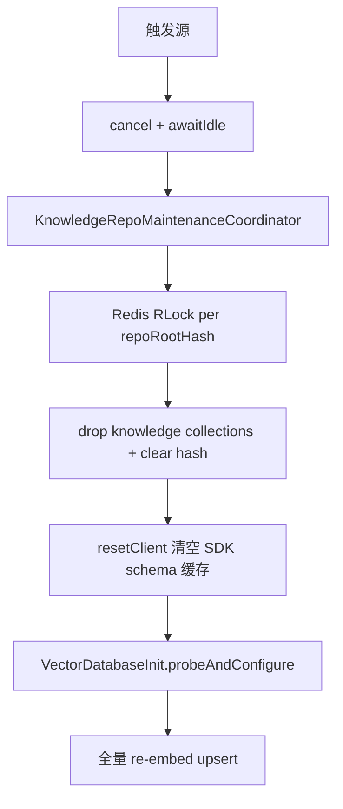
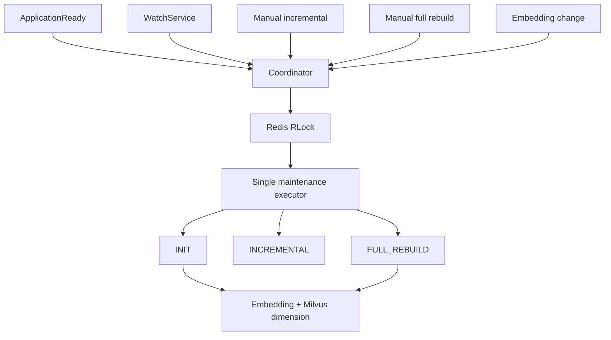

# 知识库维护

本文档固化 Markdown / AsciiDoc 知识库的目录约定、本地与远程知识库仓库机制、同步机制、统一维护协调器与 Milvus 写入规则。查询侧混合检索与超长问题融合见 [融合检索](../检索/融合检索.md)。

## 1. 目录约定

- 知识库根目录由 `j2agent.knowledge.repo.root-path` 指定。
- 根目录下的一级目录是管理端“知识库列表”的展示边界；每个一级目录显示为一条知识库记录。
- 一级目录内部可以有任意层级子目录。
- 只有 `.md`、`.adoc`、`.asciidoc` 文件会被解析、分片并同步到 Milvus。
- 图片、PDF、TXT 等其他文件不会进入向量库，仅作为静态资源被 HTTP 直链读取（见 [静态文件展示机制](../静态文件展示机制.md)）。
- 知识库元数据由管理端“知识库列表”的高级配置维护，不再读取目录内 `info.json`。
- 根目录下已有但尚未登记的一级目录会自动创建为本地文件知识库，使用默认高级配置；远程 Git 知识库仍需在知识库列表中创建配置。
- 一个知识库仓库对应一个 Milvus collection 和一组分片配置，不支持在同一仓库内按子路径配置多个 collection。

推荐结构：

```text
knowledge-repo/
  product/
    faq.md
    manual.adoc
    images/
      login.png
  ops/
    alarm.md
    assets/
      alarm-flow.png
```

## 2. 知识库列表与高级配置

管理端“知识库列表”统一展示数据库中已配置的知识库仓库，本地文件目录与远程 Git 仓库统一按“知识库仓库”建模：

- 本地文件知识库：`repoCode` 对应 `knowledge-repo/{repoCode}` 一级目录；创建配置时会确保目录存在。若一级目录已存在但 DB 中没有配置，列表加载或同步扫描前会自动补登记为 `LOCAL_FILE`，使用默认高级配置。
- 远程 Git 知识库：`repoCode` 对应 `knowledge-repo/{repoCode}` 一级目录；未填写时由 Git URL 的仓库名推导。
- 删除本地文件知识库或远程 Git 知识库都会同时删除 DB 配置和 `knowledge-repo/{repoCode}` 本地目录，并提交一次增量同步以清理已入库文件。

高级配置存储在 `knowledge_repository.metadata_config` JSON 中：

- `displayName`：知识库展示名称，存储在 `knowledge_repository.display_name`；为空时前端回退展示 `repoCode` 或 collection id，不改变真实 collection。
- `collectionName`：该仓库文档写入的 Milvus collection。未填写时按 `kb_{repoCode}` 生成并落库，repoCode 中不适合向量库命名的字符会规范为下划线。
- `partitionNames`：Milvus 分区名数组；空数组表示使用默认分区。数组内空字符串会被忽略，重复项按首次出现顺序去重。
- `minHeadingLevel`：整数 `1` 到 `3`，默认 `3`。用于控制文档优先从哪一级标题开始分片。
- `filenameAsTitle`：布尔值，默认 `true`。为 `true` 时，将文件名（去掉 `.md`、`.adoc` 或 `.asciidoc` 后缀）作为标题链最前缀。

展示名称只影响前端下拉与列表显示。聊天请求、检索器选择与 Milvus 写入仍使用真实 `collectionName`，因此配置 `displayName=产品知识库`、`collectionName=kb_product_docs` 时，前端可展示为 `产品知识库 (kb_product_docs)`，请求仍传 `kb_product_docs`。

多个仓库可以配置到同一个 `collectionName`，也可以写入不同 collection。融合并不表示文件身份被合并：`source_file` 保存的是相对 `knowledge-repo` 根目录的路径，例如 `wiki/home.md`、`manual/home.md`。因此不同一级目录下同名文件不会覆盖；增量删除、修改和 collection 迁移也仍按各自 `source_file` 精确清理。collection 的物理回收以“当前是否还有 ACTIVE 文件映射到该 collection”为准，只要任一目录仍有 ACTIVE 文件，collection 就不会被 drop。

### 2.1 远程知识库机制

远程知识库是“远程 Git 仓库 + 本地一级目录镜像 + 入库高级配置”的组合。平台先把远端内容同步到 `knowledge-repo/{repoCode}`，再复用本地知识库的 Markdown / AsciiDoc 扫描、分片、向量化与增量入库流程。

核心约定：

- 目前仅支持 `protocol=GIT`，同步由 JGit 实现，不依赖操作系统安装 Git。
- `repoCode` 是知识库根目录下的一级目录名，也是本地镜像目录名；创建远程知识库时未填写 `repoCode`，后端会从 `remoteUrl` 的仓库名推导并去掉 `.git` 后缀。
- `repoCode` 创建后不可修改，类型 `LOCAL_FILE` / `REMOTE` 也不可修改；需要更换目录边界时应删除后重建。
- `remoteUrl` 为远端仓库地址；`defaultBranch` 可为空，为空时使用远端默认分支，填写时按指定分支同步。
- 凭据通过 `credentialConfig` 提交，支持 `username`、`password`、`token` 字段；入库后加密保存在 `knowledge_repository.credential_config_cipher`，列表只返回 `hasCredential`。
- `protocolConfig` 保留为协议扩展 JSON；知识库展示名称不再存放于 `protocol_config.display_name`，而是使用独立 `display_name` 列。

创建与更新：

- 创建 `REMOTE` 配置时，若 `knowledge-repo/{repoCode}` 已存在且不是 Git 仓库，直接拒绝；若已是 Git 仓库但 `origin` 与新 `remoteUrl` 不一致，也会拒绝。
- 创建后先落库并设置状态为 `IDLE`，随后提交后台远程同步任务。
- 更新远程配置时会保存分支、远端地址、启用状态、凭据和高级配置，并提交一次知识库增量同步；远端内容拉取可通过“更新”或定时任务触发。
- 删除远程配置时会删除 DB 记录和本地镜像目录，并提交增量同步清理旧向量。

同步调度：

- 创建、手动更新和定时更新都会先提交到 `knowledge-repository-sync` 单线程后台队列，列表状态展示 `SYNCING`、`SYNCED`、`FAILED`、`DIRECTORY_MISSING` 等状态。
- 同一 `repoCode` 同时只能有一个远程同步任务；重复提交会返回“知识库仓库正在同步中”。
- 定时任务使用 `@Scheduled(cron = "0 * * * * *")` 每分钟在系统时间第 0 秒扫描到期远程仓库，再按各仓库 `update_interval_minutes` 判断是否提交同步；默认周期为 60 分钟，最小值按 1 分钟处理。
- 远程拉取成功后会记录 `last_revision`、提交说明、作者、提交时间和 `last_sync_time`，然后调用维护协调器提交一次普通增量入库。
- 如果远程拉取或后续增量入库失败，仓库状态标为 `FAILED` 并记录 `last_error`。

Git 同步语义：

- 首次同步：若本地目录不存在或不是 Git 仓库，先清理已有非 Git 目录，再 clone 远端。
- 后续同步：执行 fetch；指定分支时只 fetch 对应分支；随后强制 checkout 到目标分支，`reset --hard origin/{branch}`，并 clean 本地多余文件。
- 该语义严格对齐远端内容，本地对远程知识库镜像目录的手工修改会在下一次同步时被覆盖。
- 若因磁盘、误删、部署迁移等原因导致 DB 中有远程配置但本地一级目录不存在，列表仍会显示该远程知识库，状态为 `DIRECTORY_MISSING`；点击“更新”会重新 clone。

远程同步只负责把文档文件放入 `knowledge-repo/{repoCode}`。真正进入 Milvus 的仍只有 `.md`、`.adoc`、`.asciidoc`，图片等资源仍按 [静态文件展示机制](../静态文件展示机制.md) 提供直链。

## 3. 分片规则

- Markdown 仅识别 `#`、`##`、`###` 标题；`####` 及更深标题按正文处理。
- AsciiDoc 仅识别 `=`、`==`、`===` 标题；`====` 及更深标题按正文处理。
- 每个标题块生成一个 **逻辑 text_chunk**：
  - `text_chunk_id`：UUIDv7（[`UUIDv7Utils`](../../../../j2agent/j2agent-server/src/main/java/io/github/jerryt92/j2agent/utils/UUIDv7Utils.java)）。
  - `heading_path`：标题链，格式为 `一级 / 二级 / 三级`。
  - `text_chunk`：标题下正文，存 PostgreSQL `text` 列；**正文为空时以标题全文作为 text_chunk**。
- 每个 text_chunk 写入 Milvus 时展开为多条向量，共享同一 `text_chunk_id`：
  - **`type=title`**：嵌入 `heading_path`（1 条）。
  - **`type=content_segment`**：对 `text_chunk` 做滑动窗口切分后逐段嵌入（正文为空时不生成 content_segment）。
- `minHeadingLevel=3` 表示 Markdown 优先从 `###` 开始分片、AsciiDoc 优先从 `===` 开始分片，上级标题只参与标题链。
- 若文档中不存在达到 `minHeadingLevel` 的标题，则自动退到文档中实际存在的最深标题级别分片。
- `filenameAsTitle=true` 时，文件名会拼在标题链最前面。例如 `产品手册.md` 中的 `# 产品 / ## 登录` 会生成 `产品手册 / 产品 / 登录`。
- 若文档没有 `#`、`##`、`###` 标题，但启用了 `filenameAsTitle=true`，则以文件名作为唯一标题，全文作为 `text_chunk` 生成一个逻辑块。
- 每条 Milvus 向量主键 `segment_id` 独立 UUIDv7；同一逻辑块的多条向量共享 `text_chunk_id`。

正文切窗配置（`application.yaml`，前缀 `j2agent.knowledge.repo`）：

| 配置项 | 说明 |
|--------|------|
| `content-segment-chars` | 入库 content_segment 单段最大字符数 |
| `content-segment-overlap-chars` | 入库 content_segment 与超长 query 切分的相邻段重叠字符数（0 表示无重叠） |

切分规则：正文未超过 `content-segment-chars` 时只产生 1 段；超出时按窗口切分，下一段起点为 `end - overlap`（段尾 200 字符内优先在换行处断开）。**超长 query 的切分重叠与入库共用 `content-segment-overlap-chars`**，不再使用独立的 `query-chunk-overlap-chars`。

测试样例见 [content_segment_chunk_test.md](content_segment_chunk_test.md)。

## 4. 同步触发

所有维护任务统一由 [`KnowledgeRepoMaintenanceCoordinator`](../../../../j2agent/j2agent-server/src/main/java/io/github/jerryt92/j2agent/service/rag/knowledge/repo/KnowledgeRepoMaintenanceCoordinator.java) 单线程串行调度；跨实例互斥由 Redis 分布式锁保证。

| 触发源 | 入口 | 任务类型 |
|--------|------|----------|
| 应用启动 | `requestStartupInit()` | `INITIALIZING` → probe → 增量同步（检测到 Embedding 与 Milvus 不一致时 exclusive 完全重建） |
| 目录监听 | `requestIncrementalSync("watch")` | `INCREMENTAL_SYNC` |
| 管理端增量 | `POST .../knowledge/sync` | `INCREMENTAL_SYNC` |
| 管理端完全重建 | `POST .../knowledge/sync?fullRebuild=true` | `FULL_REBUILD` |
| Embedding 运行时变更 | `requestEmbeddingRuntimeRebuild()` | `FULL_REBUILD` |
| 手动探测 | `requestProbeOnly()` | `PROBING` |
| 检索度量变更 | `requestVectorDatabaseReloadCheck()` | `PROBING` |

- 管理端同步接口最长等待 **10 分钟**，需 ADMIN 权限。
- `watch-enabled=true` 时启用目录监听，监听整棵知识库目录。

配置示例：

```yaml
j2agent:
  knowledge:
    repo:
      root-path: /opt/j2agent/volume/knowledge-repo
      startup-sync-enabled: true
      watch-enabled: true
      # 入库 content_segment 单段最大字符数
      content-segment-chars: 6000
      # 入库 content_segment 与超长 query 切分的相邻段重叠字符数（0 表示无重叠）
      content-segment-overlap-chars: 50
```

## 5. 增量同步机制

每轮同步会先重新加载知识库列表中的启用仓库配置，然后仅扫描已配置仓库目录下的 `.md`、`.adoc`、`.asciidoc` 文件，构建文件快照。

快照差异由以下信息共同决定：

- 文档文件内容 SHA-256。
- 入库相关高级配置指纹（collection、分区、分片级别、文件名标题开关）。
- 解析到的 collection。

处理规则：

- 新增文件：解析新增文档，改写图片引用，写入对应 collection，并落库 ACTIVE 状态。
- 修改文件：先按 `source_file` 删除旧分片，再解析并写入新分片。
- 删除文件：按 `source_file` 删除该文件对应向量，并将状态标记为 DELETED。
- 修改入库相关高级配置：该仓库文档会因为配置指纹变化被判定为 modified，从而重新同步。
- 修改 collection：同步会在旧 collection 与新 collection 两侧按 `source_file` 清理，再写入新 collection，避免迁库残留。
- 同步过程不会因为单文件变更触发全量清库。

同一轮中，新增和修改文件会按文件大小从小到大处理，降低超大文件阻塞其他文件状态落库的影响。

**exclusive 门禁生效期间**，目录监听与手动增量会 **跳过**；检索侧返回降级结果，避免写入/查询维度竞争。

## 6. 空 Collection 回收

- 同步结束后会比较上一轮 ACTIVE 文件统计与当前 ACTIVE 文件统计。
- 如果某个物理 collection 上一轮有 ACTIVE 文件，而当前轮文件数为 `0`，则触发 `drop collection`。
- 如果后续又有文件映射到该 collection，写入时会自动重建 collection。

## 7. 持久化状态表

表名：`knowledge_source_file_hash`

作用：持久化文件快照与同步状态，支持服务重启后恢复增量状态。

核心字段：

- `repo_root_path`
- `file_path`
- `file_path_hash`
- `file_sha256`
- `metadata_config_hash`
- `collection_name`
- `partition_names`
- `knowledge_count`：`text_chunk` 逻辑块条数（非 Milvus 向量条数）
- `file_size_bytes`
- `last_scan_time`
- `sync_status`：`ACTIVE` / `DELETED`

## 7.1 逻辑文本块表

表名：`knowledge_text_chunk`

作用：持久化标题块完整正文（`text`），供列表展示与检索结果回填；Milvus 仅存向量与窗口切片文本。

核心字段：

- `id`（text_chunk_id，UUIDv7）
- `heading_path`
- `text_chunk`（`text`）
- `source_file`
- `collection_name`
- `file_sha256`
- `created_at` / `updated_at`

## 8. Milvus Schema

集合字段与索引由代码定义，核心字段如下：

- 主键：`segment_id`（UUIDv7，每条向量独立）
- 逻辑块 ID：`text_chunk_id`（UUIDv7，title 与 content_segment 共享）
- 分片类型：`type`（`title` / `content_segment`）
- 稠密向量：`embedding`
- 稀疏向量：`sparse`
- 检索文本：`text`（title 嵌入标题链；content_segment 嵌入窗口切片）
- 元数据：`source_file`、`heading_path`、`collection_tag`、`file_sha256`

入库向量字段 `text` 受 Milvus **8192 UTF-8 字节**限制（`MilvusKnowledgeWriteService` 过滤）；完整正文不受此限，存 PostgreSQL `knowledge_text_chunk.text_chunk`。

## 9. 完全重建（Exclusive）

### 9.1 触发条件

| 触发方式 | 说明 |
|----------|------|
| 启动时 Embedding 与 Milvus 不一致 | `requestStartupInit()` 在 probe 后检测到 collection schema 维度或 `check_embedding_hash` 与当前 Embedding 不一致（含停机期间改模型） |
| Embedding 运行时变更 | 管理端切换/修改当前 Embedding 配置（见 [LLM 提供商配置 §1.4](../../LLM提供商配置/README.md#14-embedding-向量维度与探测)） |
| 手动 `fullRebuild=true` | `POST /v1/rest/j2agent/knowledge/sync?fullRebuild=true` 或管理端「知识库 → 重建知识库 → 完全重建」 |

以上路径统一走 exclusive 完全重建：**停止所有维护任务 → drop 知识库绑定 collection → 清空 `knowledge_text_chunk` → 重建 Milvus 客户端（清 SDK schema 缓存）→ probe 当前启用 Embedding 维度 → 全量 re-embed**。

**Schema 变更（如 question/answer → type、正文与向量分离）后首次上线也必须完全重建。**

增量同步（`fullRebuild=false`）**不能**修复嵌入模型或向量维度变更后的 Milvus 维度不一致；此类场景必须使用完全重建。

### 9.2 编排步骤



**Milvus SDK 客户端 schema 缓存（换模型必读）**

Milvus Java SDK（`MilvusClientV2`）在客户端内存中缓存 collection schema；`dropCollection` 后 **不会** 自动清缓存。若换模型后仅 drop + 重建 collection，`describeCollection`（服务端真值）可能已是新维度，但 `upsert` 仍用旧缓存维度校验并报 `768 is not equal to field's dimension: 1024`。完全重建在 drop 后、probe 前调用 `VectorDatabaseService.resetClient()` 重建客户端以清空缓存。

**Embedding 变更（HTTP 立即返回）**

1. `EmbeddingChangeOrchestrator` 在 `embeddingRuntimeChanged=true` 时调用 `requestEmbeddingRuntimeRebuild()`
2. 递增 `exclusiveGeneration`，开启 exclusive 门禁，**cancel 当前维护任务并 await idle（最长 2 分钟）**
3. 后台：reload Embedding → drop 知识库绑定 collection → **`resetClient()`** → `probeAndConfigure()` 获取当前启用模型维度 → 全量 re-embed
4. 探测失败或 Redis 锁不可用 → `FAILED`，旧 generation 不得释放新门禁

**手动完全重建**

- 可强占进行中的 exclusive 完全重建（与 Embedding 变更相同）
- cancel + await idle 后 drop 知识库绑定 collection → **`resetClient()`** → probe 当前启用模型维度
- HTTP 线程等待最多 10 分钟

进度通过 `GET .../embedding/runtime` 查看（`fullRebuildRunning` 在 exclusive 门禁生效期间为 true）。

### 9.3 抢占与阻断规则

| 规则 | 行为 |
|------|------|
| Embedding 变更 / 手动完全重建 / 启动检测到模型不一致 | **互相强占**：cancel + await idle → 最新 generation 继续 drop + resetClient + probe + re-embed |
| 正常启动增量 | **不**开启 exclusive 门禁；持 Redis 锁 probe → `initializeHashCache` → 增量同步 |
| 增量同步 | **不**抢占 exclusive；exclusive 期间跳过 |
| generation 释放 | 仅当 `exclusiveGeneration` 仍等于任务 generation 时才释放门禁 |
| 被取代代次 | 静默退出，**不**误标 `FAILED` |

### 9.4 与增量同步的区别

| | 增量同步 | Exclusive 完全重建 |
|---|----------|------------------|
| 清空 Milvus collection | 否 | 是（仅 drop 知识库绑定 collection） |
| 清空哈希状态表 | 否 | 是 |
| 适用场景 | 文档增删改 | 嵌入模型/维度变更、修复异常状态 |
| diff 依据 | 文件 SHA / 高级配置指纹 / collection | 空快照，全部视为新增 |

### 9.5 故障排查：维度不一致

若日志出现 `Incorrect dimension for field 'embedding'` 或 `向量维度与当前 Embedding 不一致`：

1. 确认「设置 → Embedding 接口」顶部 **向量维度** 已探测成功；
2. 确认未在重建完成前手动触发增量同步；
3. 使用管理端 **完全重建** 或重新保存/切换 Embedding 配置以触发自动重建。

若日志表现为 **guard/describe 已是新维度（如 768），但 upsert 仍报旧维度（如 1024）**：多为 Milvus SDK 客户端 schema 缓存未清。完全重建会在 drop 后调用 `resetClient()`；若仍异常，重启应用以强制重建 `MilvusClientV2`。

**维度状态说明**

| 状态 | 来源 | 用途 |
|------|------|------|
| `EmbeddingService.dimension` | embed API 探测（`"test"` 输入） | UI 展示、重建前校验 |
| `MilvusService.lastDimension` | `reBuildVectorDatabase(dimension, …)` | 创建 collection schema、upsert/查询前校验 |

完全重建在 drop collection 后调用 `resetClient()` 清空 SDK schema 缓存，再 `probeAndConfigure` 将 `lastDimension` 与探测维度对齐。写入/查询时若发现已有 collection 的 schema 维度与期望值不一致，会 drop 重建并再次 `resetClient()`。

**外置 Milvus schema 配置**

若配置了 `J2AGENT_MILVUS_SCHEMA_CONFIG_PATH`，**不要在 JSON 中为 `embedding` 等稠密向量字段写死 `dimension`**。加载器会忽略 JSON 中的固定维度，始终使用当前 Embedding 探测维度。

## 10. 维护协调器与状态机

### 10.1 组件职责

| 类 | 职责 |
|----|------|
| `KnowledgeRepoMaintenanceCoordinator` | 单线程 executor、generation、exclusive 门禁、任务状态机 |
| `KnowledgeRepoMaintenanceLockService` | Redis `RLock`，key：`knowledge-repo:maintenance:lock:{repoRootHash}` |
| `KnowledgeRepoSyncService` | 纯同步逻辑：`executeIncrementalSync` / `executeFullRebuild` |
| `VectorDatabaseInit` | 同步方法 `probeAndConfigure()` / `reloadIfConfigurationChanged()` |



### 10.2 任务状态枚举

`KnowledgeRepoMaintenanceTaskType`：`IDLE`、`INITIALIZING`、`PROBING`、`INCREMENTAL_SYNC`、`FULL_REBUILD`、`FAILED`

对外 API：

- `isMaintenanceActive()` — 是否有非 IDLE/FAILED 任务
- `isExclusiveSyncActive()` — exclusive 门禁（完全重建窗口）
- `isFullRebuildRunning()` — 完全重建主体执行中
- `getCurrentTaskType()` / `getCurrentGeneration()`

### 10.3 Redis 分布式锁

- **粒度**：按知识库根目录 hash，不同根目录可并行。
- **持锁方式**：Redisson watchdog（`tryLock(wait, -1, MILLISECONDS)` / `lock()`），覆盖长时间 rebuild。
- **拿不到锁**：
  - watch/自动增量：记录日志并跳过
  - 手动 API：立即返回 busy（「其他实例正在维护知识库」）
  - Embedding rebuild：等待最长 2 分钟；仍失败则 `FAILED`
- **Redis 不可用**：维护写任务 **fail-fast**，**不**退化到本地锁继续 drop/upsert。

### 10.4 启动初始化流程

1. `ApplicationReady` → `requestStartupInit()`
2. 获取 Redis 锁 → `probeAndConfigureWithRetry`（最多 50 次，间隔 5s）
3. `startup-sync-enabled=true` 时，若检测到 Embedding 与 Milvus 不一致 → exclusive 完全重建；否则 `initializeHashCache()` 加载 `knowledge_source_file_hash` 后 `executeIncrementalSync` 首轮增量
4. `watch-enabled=true` 时 `startWatch` → 事件回调 `requestIncrementalSync("watch")`（probe 失败时不启动 watch）

### 10.5 API 冲突语义

| API | exclusive 生效 | 行为 |
|-----|----------------|------|
| `sync?fullRebuild=false` | 是 | 立即 busy |
| `sync?fullRebuild=true` | 是 | 立即 busy |
| Embedding 配置保存 | — | HTTP 立即返回，后台 coordinator 执行 |
| 检索 / RAG | exclusive 是 | 空结果降级 |

## 11. 验证建议

1. 多实例部署：两实例同时启动，仅一个实例日志出现 Milvus drop/upsert，另一实例「未获取 Redis 维护锁」。
2. Redis 停服后触发同步：应 fail-fast，不应继续写 Milvus。
3. 切换 Embedding 维度后：日志应出现 probe → drop → re-embed 全链路，且无 768/1024 维度异常。
4. exclusive 期间命中测试与 Agent RAG 应无 Milvus 异常，返回空或降级。
