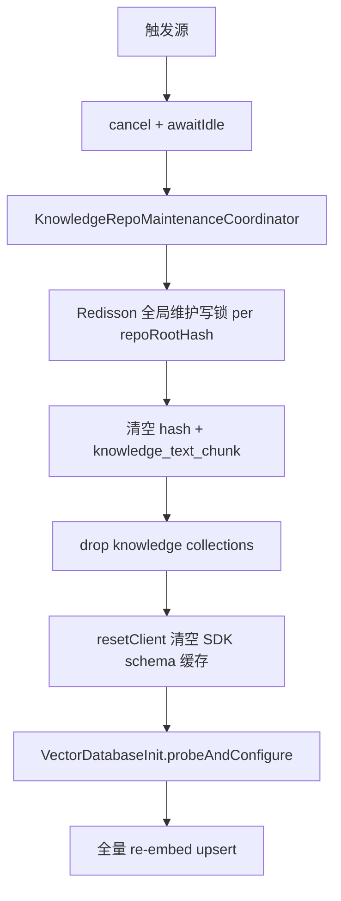
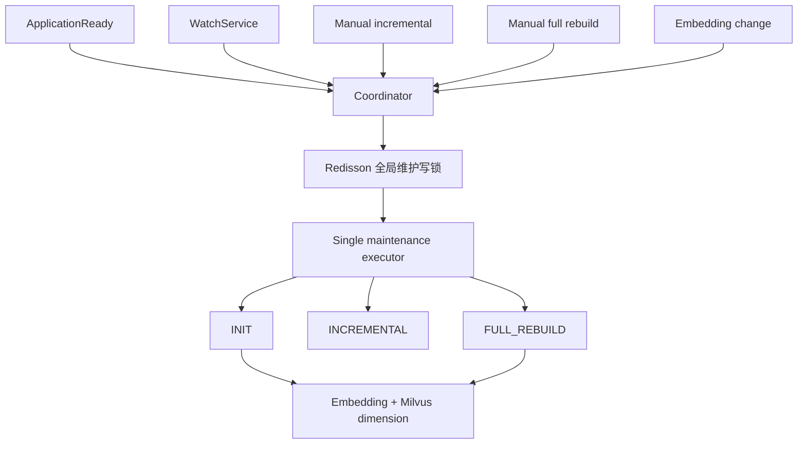

# 知识库维护

本文档固化 Markdown / AsciiDoc 知识库的目录约定、本地与远程知识库仓库机制、同步机制、单库任务与全局维护协调器、Milvus 写入规则。查询侧混合检索与超长问题融合见 [融合检索](../检索/融合检索.md)。

## 1. 目录约定

- 知识库根目录由 `j2agent.knowledge.repo.root-path` 指定。
- 根目录下的一级目录是管理端“知识库列表”的展示边界；每个一级目录显示为一条知识库记录。
- 一级目录内部可以有任意层级子目录。
- 只有 `.md`、`.adoc`、`.asciidoc` 文件会被解析、分片并同步到 Milvus。
- 图片、PDF、TXT 等其他文件不会进入向量库，仅作为静态资源被 HTTP 直链读取（见 [静态文件展示机制](../静态文件展示机制.md)）。
- 知识库元数据由管理端“知识库列表”的高级配置维护，不再读取目录内 `info.json`。
- 根目录下已有但尚未登记的一级目录会自动创建为本地文件知识库，使用默认高级配置；远程 Git 知识库仍需在知识库列表中创建配置。
- 一个知识库仓库对应一个 Milvus collection 和一组分片配置，不支持在同一仓库内按子路径配置多个 collection。

推荐结构：

```text
knowledge-repo/
  product/
    faq.md
    manual.adoc
    images/
      login.png
  ops/
    alarm.md
    assets/
      alarm-flow.png
```

## 2. 知识库列表与高级配置

管理端“知识库列表”统一展示数据库中已配置的知识库仓库，本地文件目录与远程 Git 仓库统一按“知识库仓库”建模：

- 本地文件知识库：`repoCode` 对应 `knowledge-repo/{repoCode}` 一级目录；创建配置时会确保目录存在。若一级目录已存在但 DB 中没有配置，列表加载或同步扫描前会自动补登记为 `LOCAL_FILE`，使用默认高级配置。
- 远程 Git 知识库：`repoCode` 对应 `knowledge-repo/{repoCode}` 一级目录；未填写时由 Git URL 的仓库名推导。
- 删除仓库由系统管理员或知识库管理员执行：在仓库锁内保留清理范围，清除本库授权、向量、正文和哈希，再删除目录与配置；当前知识库管理员可删除全部知识库，不限于本人创建的库。不再提交无范围全局同步。

高级配置存储在 `knowledge_repository.metadata_config` JSON 中：

- `displayName`：知识库展示名称，存储在 `knowledge_repository.display_name`；为空时前端回退展示 `repoCode` 或 collection id，不改变真实 collection。
- `collectionName`：该仓库文档写入的 Milvus collection。未填写时按 `kb_{repoCode}` 生成并落库，repoCode 中不适合向量库命名的字符会规范为下划线。
- `partitionNames`：Milvus 分区名数组；空数组表示使用默认分区。数组内空字符串会被忽略，重复项按首次出现顺序去重。
- `minHeadingLevel`：整数 `1` 到 `3`，默认 `3`。用于控制文档优先从哪一级标题开始分片。
- `filenameAsTitle`：布尔值，默认 `true`。为 `true` 时，将文件名（去掉 `.md`、`.adoc` 或 `.asciidoc` 后缀）作为标题链最前缀。

展示名称只影响前端下拉与列表显示。聊天请求通过 `knowledgeRepositoryIds` 传仓库 ID，服务端校验权限后解析 repoCode 和真实 collection；Milvus 写入仍使用 `collectionName`。不同仓库共享 collection 时，不能合并其授权范围。

多个仓库可以配置到同一个 `collectionName`，也可以写入不同 collection。融合并不表示文件身份被合并：`source_file` 保存的是相对 `knowledge-repo` 根目录的路径，例如 `wiki/home.md`、`manual/home.md`。因此不同一级目录下同名文件不会覆盖；增量删除、修改和 collection 迁移也仍按各自 `source_file` 精确清理。单库同步与删除均不 drop collection，即使当前只剩该仓库。旧全局增量路径的空 collection 回收见第 6 节，全局完全重建见第 9 节。

### 2.1 远程知识库机制

远程知识库是“远程 Git 仓库 + 本地一级目录镜像 + 入库高级配置”的组合。平台先把远端内容同步到 `knowledge-repo/{repoCode}`，再复用本地知识库的 Markdown / AsciiDoc 扫描、分片、向量化与增量入库流程。

核心约定：

- 目前仅支持 `protocol=GIT`，同步由 JGit 实现，不依赖操作系统安装 Git。
- `repoCode` 是知识库根目录下的一级目录名，也是本地镜像目录名；创建远程知识库时未填写 `repoCode`，后端会从 `remoteUrl` 的仓库名推导并去掉 `.git` 后缀。
- `repoCode` 创建后不可修改，类型 `LOCAL_FILE` / `REMOTE` 也不可修改；需要更换目录边界时应删除后重建。
- `remoteUrl` 为远端仓库地址；`defaultBranch` 可为空，为空时使用远端默认分支，填写时按指定分支同步。
- 凭据通过 `credentialConfig` 提交，支持 `username`、`password`、`token` 字段；入库后加密保存在 `knowledge_repository.credential_config_cipher`，列表只返回 `hasCredential`。
- `subPaths` 为远程 Git 知识库的可选子路径列表，路径相对于 Git 仓库根目录；为空表示同步整个仓库。配置后平台只把这些子路径物化到 `knowledge-repo/{repoCode}`，并只扫描这些路径。
- `protocolConfig` 保留为协议扩展 JSON；当前用于存储 `subPaths` 等协议级同步策略。知识库展示名称不再存放于 `protocol_config.display_name`，而是使用独立 `display_name` 列。

子路径规则：

- 每个子路径会去除首尾 `/`，并将 `\` 规范为 `/`，例如 `docs/` 保存为 `docs`。
- 禁止空路径、绝对路径、`.`、`..`，以及包含 `.` 或 `..` 段的路径。
- 禁止重复路径，也禁止互为父子路径，例如不能同时配置 `docs` 与 `docs/api`。
- 子路径不存在于目标 revision 时，远程拉取失败并写入 `last_error`；外围单库任务将仓库最终状态设为 `REBUILD_FAILED`。

创建与更新：

- 创建 `REMOTE` 配置时，若 `knowledge-repo/{repoCode}` 已存在且不是 Git 仓库，直接拒绝；若已是 Git 仓库但 `origin` 与新 `remoteUrl` 不一致，也会拒绝。
- 创建后先落库并设置状态为 `IDLE`，随后提交后台远程同步任务。
- 更新远程配置时会保存分支、远端地址、启用状态、凭据和高级配置，并提交一次知识库增量同步；远端内容拉取可通过“更新”或定时任务触发。
- 删除远程配置时会删除 DB 记录和本地镜像目录，并提交增量同步清理旧向量。

同步调度：

- 创建、手动更新和定时更新提交到 `RepositoryMaintenanceService` 的按库线程池；同库串行，异库可并行。任务状态与仓库最终状态见第 4.1 节；目录丢失仍显示 `DIRECTORY_MISSING`。
- 同一 `repoCode` 同时只能有一个远程同步任务；重复提交会返回“知识库仓库正在同步中”。
- 定时任务使用 `@Scheduled(cron = "0 * * * * *")` 每分钟在系统时间第 0 秒扫描到期远程仓库，再按各仓库 `update_interval_minutes` 判断是否提交同步；默认周期为 60 分钟，最小值按 1 分钟处理。
- 远程拉取成功后会记录 `last_revision`、提交说明、作者、提交时间和 `last_sync_time`，然后在同一仓库任务内执行目标仓库的增量入库，不提交全局扫描。
- 任务内远程拉取或后续增量入库失败，任务状态为 `FAILED`，仓库最终标为 `FAILED` 并记录 `last_error`；该库暂停检索，允许再次同步。

Git 同步语义：

- 首次同步：若本地目录不存在或不是 Git 仓库，先清理已有非 Git 目录，再 clone 远端。
- 未配置 `subPaths` 时，首次 clone 后完整 checkout；后续同步执行 fetch，指定分支时只 fetch 对应分支，随后强制 checkout 到目标分支，`reset --hard origin/{branch}`，并 clean 本地多余文件。
- 配置 `subPaths` 时，首次 clone 使用 JGit `noCheckout`，随后仅 checkout 匹配子路径内的文件；后续同步 fetch 后强制对齐本地分支和 `HEAD`，清理除 `.git` 外的工作区内容，再只 checkout 配置子路径。
- 从“配置子路径”改回“空子路径”后，下一次同步会恢复完整工作区。
- 该语义严格对齐远端内容，本地对远程知识库镜像目录的手工修改会在下一次同步时被覆盖。
- 若因磁盘、误删、部署迁移等原因导致 DB 中有远程配置但本地一级目录不存在，列表仍会显示该远程知识库，状态为 `DIRECTORY_MISSING`；点击“更新”会重新 clone。

远程同步只负责把文档文件放入 `knowledge-repo/{repoCode}`。真正进入 Milvus 的仍只有 `.md`、`.adoc`、`.asciidoc`，图片等资源仍按 [静态文件展示机制](../静态文件展示机制.md) 提供直链。当前实现保持纯 Java/JGit，不依赖系统 `git`；`subPaths` 控制本地工作区物化和扫描范围，不承诺像原生 Git partial clone 那样最大化减少远端对象下载。

### 2.2 知识库列表状态展示

知识库列表（`GET /v1/rest/j2agent/knowledge/repositories`）面向所有对该库有读取权限的用户，**只展示状态标签，不展示文件级进度或百分比**。

| 列表状态 | 含义 | 来源 |
|----------|------|------|
| `IDLE` | 空闲，可提交同步 | 库表 `knowledge_repository.status` 或目录缺失前的默认态 |
| `SYNCING` | 本库增量同步进行中 | 库表；同库任务执行期间 |
| `SYNCED` | 远程拉取成功后的过渡态（随后通常回到 `IDLE`） | 远程 Git 同步成功时短暂写入 |
| `FAILED` | 本库同步失败 | 库表 + `last_error` |
| `DELETING` | 本库删除进行中 | 库表 |
| `DIRECTORY_MISSING` | 配置存在但本地一级目录不存在 | 列表接口按路径检测覆盖展示 |
| `GLOBAL_REBUILDING` | 管理员触发的全局完全重建进行中 | **不落库**；全局 `isFullRebuildRunning()` 为真时，列表中所有可见仓库统一覆盖为此状态 |
| `REBUILDING` / `REBUILD_FAILED` | 历史/兼容态，前端仍识别文案 | 库表若残留则原样展示；当前按库任务不再写入 `REBUILDING` |

展示规则：

- 有库读取权限的知识库管理员可见上述状态，**普通用户不可进入知识库列表页**。
- 全局完全重建期间，各库在列表中显示「全局重建中」，同步/编辑/删除按钮按忙碌规则禁用；详细文件进度在「知识列表 → 同步状态」页查看（需系统管理员或知识库管理员）。
- 列表在 `SYNCING`、`GLOBAL_REBUILDING`、`DELETING` 等进行中状态时每 2 秒静默刷新一次，仅更新状态标签，不整表 loading。

## 3. 分片规则

- Markdown 仅识别 `#`、`##`、`###` 标题；`####` 及更深标题按正文处理。
- AsciiDoc 仅识别 `=`、`==`、`===` 标题；`====` 及更深标题按正文处理。
- 每个标题块生成一个 **逻辑 text_chunk**：
  - `text_chunk_id`：UUIDv7（[`UUIDv7Utils`](../../../../j2agent/j2agent-server/src/main/java/io/github/jerryt92/j2agent/utils/UUIDv7Utils.java)）。
  - `heading_path`：标题链，格式为 `一级 / 二级 / 三级`。
  - `text_chunk`：标题下正文，存 PostgreSQL `text` 列；**正文为空时以标题全文作为 text_chunk**。
- 每个 text_chunk 写入 Milvus 时展开为多条向量，共享同一 `text_chunk_id`：
  - **`type=title`**：嵌入 `heading_path`（1 条）。
  - **`type=content_segment`**：对 `text_chunk` 做滑动窗口切分后逐段嵌入（正文为空时不生成 content_segment）。
- `minHeadingLevel=3` 表示 Markdown 优先从 `###` 开始分片、AsciiDoc 优先从 `===` 开始分片，上级标题只参与标题链。
- 若文档中不存在达到 `minHeadingLevel` 的标题，则自动退到文档中实际存在的最深标题级别分片。
- `filenameAsTitle=true` 时，文件名会拼在标题链最前面。例如 `产品手册.md` 中的 `# 产品 / ## 登录` 会生成 `产品手册 / 产品 / 登录`。
- 若文档没有 `#`、`##`、`###` 标题，但启用了 `filenameAsTitle=true`，则以文件名作为唯一标题，全文作为 `text_chunk` 生成一个逻辑块。
- 每条 Milvus 向量主键 `segment_id` 独立 UUIDv7；同一逻辑块的多条向量共享 `text_chunk_id`。

正文切窗配置（`application.yaml`，前缀 `j2agent.knowledge.repo`）：

| 配置项 | 说明 |
|--------|------|
| `content-segment-chars` | 入库 content_segment 单段最大字符数 |
| `content-segment-overlap-chars` | 入库 content_segment 与超长 query 切分的相邻段重叠字符数（0 表示无重叠） |

切分规则：正文未超过 `content-segment-chars` 时只产生 1 段；超出时按窗口切分，下一段起点为 `end - overlap`（段尾 200 字符内优先在换行处断开）。**超长 query 的切分重叠与入库共用 `content-segment-overlap-chars`**，不再使用独立的 `query-chunk-overlap-chars`。

测试样例见 [content_segment_chunk_test.md](content_segment_chunk_test.md)。

## 4. 同步触发

### 4.1 单库任务

`RepositoryMaintenanceService` 使用独立线程池执行按库任务；创建后初始化、配置修改后的增量同步、手动同步与远程周期同步都携带目标仓库范围。权限规则见 [用户权限](../../安全与用户/用户权限.md)。

接口前缀为 `/v1/rest/j2agent/knowledge/repositories`：

| 方法及路径 | 权限与结果 |
|------------|------------|
| POST `/{id}/sync` | 创建者、管理员或有效等级 1；200 返回任务提交结果及 taskId，不代表入库完成 |
| GET `/{id}/tasks` | 需该库读取权限；返回最近 50 个任务及状态、错误与时间 |
| PUT `/{id}` | 创建者、管理员或有效等级 1；配置变更提交目标库增量同步 |
| DELETE `/{id}` | 仅创建者或管理员；清理目标库，不删除共享 collection |

同步按文件哈希做增量。扫描范围限制为目标 repoCode；删除范围从 PostgreSQL 正文与文件哈希中的仓库来源确定，向量按 source_file 精确清理，不清空共享 collection 或全局哈希。Collection 变更时，按已有记录清理本库旧位置再写入新位置。无法由来源记录定位的数据不能据 collection 归属猜测删除，应交由管理员核查。

**完全重建仅能通过全局维护入口触发**（`POST .../knowledge/sync?fullRebuild=true` 或 Embedding 变更自动触发；需系统管理员或知识库管理员）。不提供按单库 drop collection 的「分库重建」；单库入口只有增量 `SYNC`。

任务表 `knowledge_repository_task` 记录 `repository_id`、`repo_code`、`user_id`、`operation` 及时间；当前 `operation` 固定为 `SYNC`。任务状态为 `QUEUED → RUNNING → COMPLETED / FAILED`，失败写入 `error_message`。仓库在同步任务执行期间为 `SYNCING`，成功回到 `IDLE`，失败为 `FAILED`。RAG 自动选库会排除 `SYNCING`、`FAILED`、`DELETING` 等维护态；用户显式指定这些库时返回 `KNOWLEDGE_UNAVAILABLE`。

同库处于 `SYNCING`、`REBUILDING` 或 `DELETING` 时拒绝再次提交，返回 `409 KNOWLEDGE_BUSY`。其他仓库可独立执行；需要创建共享 collection 时仍会短暂竞争结构锁。

进程异常退出后，`RepositoryMaintenanceService.recoverInterruptedTasks()` 会回收卡住的按库任务与仓库状态（见 §10.5）。单库任务表只记录阶段状态，**不提供文件级进度**；文件级进度仅全局维护协调器在管理端「同步状态」页展示。

### 4.2 全局维护入口

全局维护任务由 [`KnowledgeRepoMaintenanceCoordinator`](../../../../j2agent/j2agent-server/src/main/java/io/github/jerryt92/j2agent/service/rag/knowledge/repo/KnowledgeRepoMaintenanceCoordinator.java) 单线程串行调度；跨实例互斥由 Redis 分布式锁保证。

| 触发源 | 入口 | 任务类型 |
|--------|------|----------|
| 应用启动 | `requestStartupInit()` | `INITIALIZING` → probe → 增量同步（检测到 Embedding 与 Milvus 不一致时 exclusive 完全重建） |
| 目录监听 | `requestIncrementalSync("watch")` | `INCREMENTAL_SYNC` |
| 管理端增量 | `POST .../knowledge/sync` | `INCREMENTAL_SYNC` |
| 管理端完全重建 | `POST .../knowledge/sync?fullRebuild=true` | `FULL_REBUILD` |
| Embedding 运行时变更 | `requestEmbeddingRuntimeRebuild()` | `FULL_REBUILD` |
| 手动探测 | `requestProbeOnly()` | `PROBING` |
| 检索度量变更 | `requestVectorDatabaseReloadCheck()` | `PROBING` |

全局维护相关 HTTP 接口（需 **系统管理员或知识库管理员**）：

| 方法及路径 | 说明 |
|------------|------|
| `POST /v1/rest/j2agent/knowledge/sync` | `fullRebuild=false` 提交增量；`fullRebuild=true` 提交完全重建；最长等待 10 分钟 |
| `GET /v1/rest/j2agent/knowledge/sync/status` | 全局维护快照：任务类型、阶段、文件进度、当前文件、失败原因、Embedding 就绪态 |

- `watch-enabled=true` 时启用目录监听，监听整棵知识库目录。

配置示例：

```yaml
j2agent:
  knowledge:
    repo:
      root-path: /opt/j2agent/volume/knowledge-repo
      startup-sync-enabled: true
      watch-enabled: true
      # 入库 content_segment 单段最大字符数
      content-segment-chars: 6000
      # 入库 content_segment 与超长 query 切分的相邻段重叠字符数（0 表示无重叠）
      content-segment-overlap-chars: 50
```

## 5. 增量同步机制

每轮同步会先重新加载知识库列表中的启用仓库配置，然后仅扫描已配置仓库目录下的 `.md`、`.adoc`、`.asciidoc` 文件，构建文件快照。远程 Git 知识库若配置了 `subPaths`，扫描根会收窄到 `knowledge-repo/{repoCode}/{subPath}`；未配置时扫描整个 `knowledge-repo/{repoCode}`。`source_file` 始终保存相对 `knowledge-repo` 根目录的路径，例如 `repoCode/docs/guide.md`。

快照差异由以下信息共同决定：

- 文档文件内容 SHA-256。
- 入库相关高级配置指纹（collection、分区、分片级别、文件名标题开关）。
- 解析到的 collection。

处理规则：

- 新增/修改文件：写向量前先将 `knowledge_source_file_hash.sync_status` 置为 `SYNCING`，整文件 Milvus 与 `knowledge_text_chunk` 写完后翻为 `ACTIVE`（见 §7）。
- 新增文件：解析新增文档，改写图片引用，写入对应 collection。
- 修改文件：先按 `source_file` 删除旧分片，再解析并写入新分片。
- 删除文件：按 `source_file` 删除该文件对应向量，并将状态标记为 DELETED。
- 修改入库相关高级配置：该仓库文档会因为配置指纹变化被判定为 modified，从而重新同步。
- 修改 collection：同步会在旧 collection 与新 collection 两侧按 `source_file` 清理，再写入新 collection，避免迁库残留。
- 同步过程不会因为单文件变更触发全量清库。

同一轮中，新增和修改文件会按文件大小从小到大处理，降低超大文件阻塞其他文件状态落库的影响。

**exclusive 门禁生效期间**，目录监听与手动增量会 **跳过**；检索侧返回降级结果，避免写入/查询维度竞争。

## 6. 全局增量路径的空 Collection 回收

- 以下回收仅描述原有全局增量路径；单库入口不执行此逻辑。
- 全局同步结束后会比较上一轮 ACTIVE 文件统计与当前 ACTIVE 文件统计。
- 如果某个物理 collection 上一轮有 ACTIVE 文件，而当前轮文件数为 `0`，则触发 `drop collection`。
- 如果后续又有文件映射到该 collection，写入时会自动重建 collection。

## 7. 持久化状态表

表名：`knowledge_source_file_hash`

作用：持久化文件快照与同步状态，支持服务重启后恢复增量状态。

核心字段：

- `repo_root_path`
- `file_path`
- `file_path_hash`
- `file_sha256`
- `metadata_config_hash`
- `collection_name`
- `partition_names`
- `knowledge_count`：`text_chunk` 逻辑块条数（非 Milvus 向量条数）
- `file_size_bytes`
- `last_scan_time`
- `sync_status`：`SYNCING` / `ACTIVE` / `DELETED`

`sync_status` 的状态流转是中断可恢复的基础：写向量**前**先落 `SYNCING`，整文件写完后才翻成 `ACTIVE`。

| 状态 | 含义 | 下一轮同步的处理 |
|------|------|------------------|
| `SYNCING` | 入库进行中；残留即代表上一轮在该文件上被打断 | 先按记录的 collection `deleteBySourceFile` 清理半截向量，再重新入库 |
| `ACTIVE` | 已完整入库 | 参与 diff，未变更则跳过 |
| `DELETED` | 源文件已删除 | 不参与 diff |

只有 `ACTIVE` 进入 `loadSnapshot()` 的 diff 基线，因此失败、跳过、被打断的文件都不会被误判为「已同步」，必然在下一轮被重新处理。

## 7.1 逻辑文本块表

表名：`knowledge_text_chunk`

作用：持久化标题块完整正文（`text`），供列表展示与检索结果回填；Milvus 仅存向量与窗口切片文本。

核心字段：

- `id`（text_chunk_id，UUIDv7）
- `heading_path`
- `text_chunk`（`text`）
- `source_file`
- `collection_name`
- `file_sha256`
- `created_at` / `updated_at`

## 8. Milvus Schema

集合字段与索引由代码定义，核心字段如下：

- 主键：`segment_id`（UUIDv7，每条向量独立）
- 逻辑块 ID：`text_chunk_id`（UUIDv7，title 与 content_segment 共享）
- 分片类型：`type`（`title` / `content_segment`）
- 稠密向量：`embedding`
- 稀疏向量：`sparse`
- 检索文本：`text`（title 嵌入标题链；content_segment 嵌入窗口切片）
- 元数据：`source_file`、`heading_path`、`collection_tag`、`file_sha256`

入库向量字段 `text` 受 Milvus **8192 UTF-8 字节**限制（`MilvusKnowledgeWriteService` 过滤）；完整正文不受此限，存 PostgreSQL `knowledge_text_chunk.text_chunk`。

## 9. 管理员全局完全重建（Exclusive）

完全重建是**唯一**会 drop 知识库绑定 collection 并清空哈希树的维护路径，用于嵌入模型/维度变更、Milvus schema 升级后的修复，以及管理员手动修复异常状态。与按库增量 `SYNC` 严格分离：单库接口不会 drop collection，也不会清空全局哈希。

### 9.1 触发条件

| 触发方式 | 说明 |
|----------|------|
| 启动时 Embedding 与 Milvus 不一致 | `requestStartupInit()` 在 probe 后检测到 collection schema 维度或 `check_embedding_hash` 与当前 Embedding 不一致（含停机期间改模型） |
| Embedding 运行时变更 | 管理端切换/修改当前 Embedding 配置（见 [LLM 提供商配置 §1.4](../../LLM提供商配置/README.md#14-embedding-向量维度与探测)） |
| 手动 `fullRebuild=true` | `POST /v1/rest/j2agent/knowledge/sync?fullRebuild=true` 或管理端「知识库 → 重建知识库 → 完全重建」 |

以上路径统一走 exclusive 完全重建：**停止所有维护任务 → 清空哈希与 `knowledge_text_chunk` → drop 知识库绑定 collection → 重建 Milvus 客户端（清 SDK schema 缓存）→ probe 当前启用 Embedding 维度 → 全量 re-embed**。

**Schema 变更（如 question/answer → type、正文与向量分离）后首次上线也必须完全重建。**

增量同步（`fullRebuild=false`）**不能**修复嵌入模型或向量维度变更后的 Milvus 维度不一致；此类场景必须使用完全重建。

### 9.2 编排步骤



**清空哈希必须早于 drop collection**：两步之间被打断时，若哈希仍在，重启后的增量同步会判定「无变更」而永不重新入库，知识库永久为空且状态看起来一切正常；反序则最坏只是重新入库一遍。

**Milvus SDK 客户端 schema 缓存（换模型必读）**

Milvus Java SDK（`MilvusClientV2`）在客户端内存中缓存 collection schema；`dropCollection` 后 **不会** 自动清缓存。若换模型后仅 drop + 重建 collection，`describeCollection`（服务端真值）可能已是新维度，但 `upsert` 仍用旧缓存维度校验并报 `768 is not equal to field's dimension: 1024`。完全重建在 drop 后、probe 前调用 `VectorDatabaseService.resetClient()` 重建客户端以清空缓存。

**Embedding 变更（HTTP 立即返回）**

1. `EmbeddingChangeOrchestrator` 在 `embeddingRuntimeChanged=true` 时调用 `requestEmbeddingRuntimeRebuild()`
2. 递增 `exclusiveGeneration`，开启 exclusive 门禁，**cancel 当前维护任务并 await idle（最长 2 分钟）**
3. 后台：reload Embedding → **先清空 hash 与 `knowledge_text_chunk`** → drop 知识库绑定 collection → **`resetClient()`** → `probeAndConfigure()` → 全量 re-embed
4. 探测失败或 Redis 锁不可用 → `FAILED`，旧 generation 不得释放新门禁

**手动完全重建**

- 与 Embedding 变更相同，可强占进行中的 exclusive 完全重建
- cancel + await idle 后执行准备阶段（清 hash → drop collection → `resetClient()` → probe）再全量 re-embed
- HTTP 线程最长等待 10 分钟；若返回成功仅表示任务已提交并完成协调，文件级结果以 `GET .../sync/status` 为准

**管理端展示分工**

| 页面 | 权限 | 展示内容 |
|------|------|----------|
| 知识库列表 | 有库读取权限 | 各库状态标签；全局重建时统一显示 `GLOBAL_REBUILDING`，**无进度条** |
| 知识列表 → 同步状态 | 系统管理员 / 知识库管理员 | 全局任务类型、阶段、文件进度、当前文件、失败原因、Embedding 探测态 |
| 知识列表 → 重建知识库 | 系统管理员 / 知识库管理员 | 触发增量或完全重建（完全重建需二次确认文案） |

`GET .../embedding/runtime` 的 `fullRebuildRunning` 在 exclusive 门禁生效期间为 true，可与 `sync/status` 对照使用。

### 9.3 抢占与阻断规则

| 规则 | 行为 |
|------|------|
| Embedding 变更 / 手动完全重建 / 启动检测到模型不一致 | **互相强占**：cancel + await idle → 最新 generation 继续 drop + resetClient + probe + re-embed |
| 正常启动增量 | **不**开启 exclusive 门禁；持 Redis 锁 probe → `initializeHashCache` → 增量同步 |
| 增量同步 | **不**抢占 exclusive；exclusive 期间跳过 |
| generation 释放 | 仅当 `exclusiveGeneration` 仍等于任务 generation 时才释放门禁 |
| 被取代代次 | 静默退出，**不**误标 `FAILED` |

### 9.4 与增量同步的区别

| | 增量同步 | Exclusive 完全重建 |
|---|----------|------------------|
| 触发权限 | 按库：创建者/知识库管理员/等级 1；全局增量：系统或知识库管理员 | **系统或知识库管理员**（或启动/Embedding 自动触发） |
| 清空 Milvus collection | 否 | 是（仅 drop 知识库绑定 collection） |
| 清空哈希状态表 | 否 | 是 |
| 列表状态 | 单库 `SYNCING` | 全部可见库 `GLOBAL_REBUILDING` |
| 适用场景 | 文档增删改、单库配置变更 | 嵌入模型/维度变更、修复异常状态 |
| diff 依据 | 文件 SHA / 高级配置指纹 / collection | 空快照，全部视为新增 |
| 中断后 | 下轮增量自动补齐未 ACTIVE 文件 | 须管理员重试完全重建；未完整入库报 FAILED |

### 9.5 中断后的入库完整性

重建全程没有跨 Milvus 与关系库的事务，因此不追求「原子完成」，而是保证**任何中断点重启后都能自愈，且不会产生重复向量**。三条不变式：

| 不变式 | 实现 | 中断在此处的后果 |
|--------|------|------------------|
| 哈希先于向量清空 | `runFullRebuildPreparation` 先 `deleteAll()` 再 `dropCollection` | 哈希已空 → 重启后全部文件视为新增，重新入库 |
| 哈希晚于向量写入 | `upsertFile` 先 `markSyncing` 再写向量，成功后才 `upsertActive` | 残留 `SYNCING` 行 → 下一轮先删半截向量再重入 |
| 未入库不得报成功 | `executeFullRebuild` 统计失败/跳过文件数，非零时抛异常 | 协调器置 `FAILED` 并把「未完整入库：失败 N 个、跳过 M 个」透出到管理端 |

同步开始时执行两类残留清理（`KnowledgeRepoSyncService.doSyncBodyInternal` 开头）：

1. **半截文件残留**：存在 `SYNCING` 行 → 按其 `collection_name` 删除该 `source_file` 的全部向量后重新入库。向量主键是随机 UUIDv7，不先删就会在重入时留下重复向量。
2. **孤儿 collection**：哈希表为空但配置的知识库 collection 仍存在 → 判定为「上一轮完全重建清空哈希后被打断」，drop 后全量重入。这一步同时兜住了 drop 只完成一半的场景。

按库同步（`executeRepositorySync`）只清理本库前缀下的半截文件，不做孤儿 collection 回收，避免误删共享 collection。

失败或跳过的文件不会留下 `ACTIVE` 哈希，因此后续任意一次增量同步都会自动补齐；完全重建则要求一次跑完，未完整时必须由管理员重试。

### 9.6 协调器与列表态联动

全局完全重建由 `KnowledgeRepoMaintenanceCoordinator` 持有 exclusive 门禁；`isFullRebuildRunning()` 为真时，`KnowledgeRepositoryService.toItem()` 将列表中每个可见仓库的展示状态覆盖为 `GLOBAL_REBUILDING`（**不写回库表**，避免与按库任务状态混淆）。

协调器内存态在进程重启后会丢失，但已通过以下机制避免界面长期卡在「同步进行中」：

| 机制 | 作用 |
|------|------|
| `pendingTasks` 计数 | `isMaintenanceActive()` / `isFullRebuildRunning()` 仅在确有在跑任务时为真 |
| `releaseStaleRunningState()` | 任务队列排空后回收泄漏的 `currentTaskType` 与 exclusive 门禁 |
| `snapshotSyncStatus()` | 无在跑任务时对外上报 `IDLE`，避免管理端进度页假死 |
| `retryStartupInitIfIncomplete()` | 启动初始化未完成时每 5 分钟重试 |
| `recoverInterruptedTasks()` | 按库 `SYNCING`/`DELETING` 与未结束任务每 2 分钟回收（§10.5） |

### 9.7 故障排查：维度不一致

若日志出现 `Incorrect dimension for field 'embedding'` 或 `向量维度与当前 Embedding 不一致`：

1. 确认「设置 → Embedding 接口」顶部 **向量维度** 已探测成功；
2. 确认未在重建完成前手动触发增量同步；
3. 使用管理端 **完全重建** 或重新保存/切换 Embedding 配置以触发自动重建。

若日志表现为 **guard/describe 已是新维度（如 768），但 upsert 仍报旧维度（如 1024）**：多为 Milvus SDK 客户端 schema 缓存未清。完全重建会在 drop 后调用 `resetClient()`；若仍异常，重启应用以强制重建 `MilvusClientV2`。

**维度状态说明**

| 状态 | 来源 | 用途 |
|------|------|------|
| `EmbeddingService.dimension` | embed API 探测（`"test"` 输入） | UI 展示、重建前校验 |
| `MilvusService.lastDimension` | `reBuildVectorDatabase(dimension, …)` | 创建 collection schema、upsert/查询前校验 |

完全重建在 drop collection 后调用 `resetClient()` 清空 SDK schema 缓存，再 `probeAndConfigure` 将 `lastDimension` 与探测维度对齐。普通 collection 初始化/写入遇到已有 schema 维度不匹配时拒绝操作，要求管理员执行全局完全重建，不在单库路径自动 drop 共享 collection。

**外置 Milvus schema 配置**

若配置了 `J2AGENT_MILVUS_SCHEMA_CONFIG_PATH`，**不要在 JSON 中为 `embedding` 等稠密向量字段写死 `dimension`**。加载器会忽略 JSON 中的固定维度，始终使用当前 Embedding 探测维度。

## 10. 维护协调器与状态机

### 10.1 组件职责

| 类 | 职责 |
|----|------|
| `KnowledgeRepoMaintenanceCoordinator` | 单线程 executor、generation、exclusive 门禁、任务状态机 |
| `KnowledgeRepoMaintenanceLockService` | Redisson `RReadWriteLock`，key：`knowledge-repo:maintenance:lock:{repoRootHash}`；全局持写锁，单库持读锁 |
| `RepositoryMaintenanceService` | 单库任务线程池、仓库锁、任务状态与失败隔离 |
| `KnowledgeRepoSyncService` | 全局 `executeIncrementalSync` / `executeFullRebuild`；单库 `executeRepositorySync` / `deleteRepositoryData` |
| `VectorDatabaseInit` | 同步方法 `probeAndConfigure()` / `reloadIfConfigurationChanged()` |



### 10.2 任务状态枚举

`KnowledgeRepoMaintenanceTaskType`：`IDLE`、`INITIALIZING`、`PROBING`、`INCREMENTAL_SYNC`、`FULL_REBUILD`、`FAILED`

对外 API：

- `isMaintenanceActive()` — 任务类型非 IDLE/FAILED **且**确实存在已提交未结束的任务
- `isExclusiveSyncActive()` — exclusive 门禁（完全重建窗口）
- `isFullRebuildRunning()` — 完全重建主体执行中
- `getCurrentTaskType()` / `getCurrentGeneration()`

维护任务队列排空时会回收残留状态：中断、代次失效等分支会提前 return 而不复位状态，若不回收，`maintenanceActive` 会永久为真，前端一直停在「知识库同步进行中，请稍候…」，且残留的 exclusive 门禁会让后续所有增量同步被静默跳过。`snapshotSyncStatus()` 在无在跑任务时对外统一上报 `IDLE`。

### 10.3 Redis 分布式锁

- **全局门禁**：按知识库根目录 hash 使用 Redisson 读写锁；单库任务持读锁，全局维护（包括原全局增量路径）持写锁。
- **仓库互斥**：单库同步、重建、配置修改和删除使用 `knowledge-repo:repository:{id}` 对应的 RLock。同库串行，不同库可并行。
- **结构保护**：Milvus collection 初始化使用 Collection 级 RLock；固定顺序为全局门禁 → 仓库锁 → 必要的 Collection 结构锁。
- **线程所有权**：后台任务由实际执行线程取锁并在 finally 中释放，不把 HTTP 线程持有的锁转交给后台线程。用户权限锁内不等待或执行维护。
- **单库等待**：读门禁与仓库锁各最多等待 5 秒，未获取返回 KNOWLEDGE_BUSY；使用 Watchdog，不指定短固定租期。
- **持锁方式**：Redisson watchdog（`tryLock(wait, -1, MILLISECONDS)` / `lock()`），覆盖长时间 rebuild。
- **拿不到锁**：
  - watch/自动增量：记录日志并跳过
  - 手动 API：立即返回 busy（「其他实例正在维护知识库」）
  - Embedding rebuild：等待最长 2 分钟；仍失败则 `FAILED`
- **Redis 不可用**：维护写任务 **fail-fast**，**不**退化到本地锁继续 drop/upsert。

### 10.4 启动初始化流程

1. `ApplicationReady` → `requestStartupInit()`
2. 获取 Redis 锁 → `probeAndConfigureWithRetry`（最多 50 次，间隔 5s）
3. `startup-sync-enabled=true` 时，若检测到 Embedding 与 Milvus 不一致 → exclusive 完全重建；否则 `initializeHashCache()` 加载 `knowledge_source_file_hash` 后 `executeIncrementalSync` 首轮增量
4. `watch-enabled=true` 时 `startWatch` → 事件回调 `requestIncrementalSync("watch")`（probe 失败时不启动 watch）

启动初始化未走完（Embedding 未配置、probe 失败、Redis 锁被其他实例占用）时不再一次性放弃：`retryStartupInitIfIncomplete()` 每 5 分钟重试一次，直到成功；`startup-sync-enabled=false` 视为已完成，不重试。

### 10.5 重启后的状态回收

进程退出会丢掉协调器的内存状态，但库表里的按库维护态不会自愈：仓库停在 `SYNCING`/`REBUILDING`/`DELETING`，任务停在 `QUEUED`/`RUNNING`，导致该库后续同步一直返回 409 `KNOWLEDGE_BUSY`、定时同步也跳过，界面停在「同步中」却无人推进。

`RepositoryMaintenanceService.recoverInterruptedTasks()` 在 `ApplicationReady` 与每 2 分钟的定时任务中扫描并回收：

| 判定项 | 说明 |
|--------|------|
| 静默时长 | 仓库与其未结束任务的 `updated_at` 均超过 2 分钟 |
| 本实例在跑 | `runningTasks` 中存在未完成 Future 则跳过 |
| 其他实例在跑 | `knowledge-repo:repository:{id}` 锁仍被持有则跳过（锁全程持有，实例宕机后由 watchdog 过期） |

回收动作：未结束任务置 `FAILED`（`任务已被服务重启中断`），维护态仓库复位为 `IDLE` 并写入 `last_error`，随后由定时同步或手动同步正常接管。

### 10.6 API 冲突语义

| API | exclusive 生效 | 行为 |
|-----|----------------|------|
| `sync?fullRebuild=false` | 是 | 立即 busy |
| `sync?fullRebuild=true` | 是 | 立即 busy |
| Embedding 配置保存 | — | HTTP 立即返回，后台 coordinator 执行 |
| 检索 / RAG | exclusive 是 | 空结果降级 |

## 11. 验证建议

### 11.1 分布式与锁

1. 多实例部署：两实例同时启动，仅一个实例日志出现 Milvus drop/upsert，另一实例「未获取 Redis 维护锁」。
2. Redis 停服后触发同步：应 fail-fast，不应继续写 Milvus。

### 11.2 完全重建

3. 切换 Embedding 维度后：日志应出现 **清 hash → drop → resetClient → probe → re-embed** 全链路，且无 768/1024 维度异常。
4. exclusive 期间命中测试与 Agent RAG 应无 Milvus 异常，返回空或降级。
5. 完全重建刚清空哈希、collection 尚未 drop 完时强杀并重启：日志出现「哈希已清空但 collection 仍存在」并 drop 后全量重入，最终 Milvus 条数与文档数一致、无重复向量。
6. 单文件向量化中途强杀并重启：该文件残留 `SYNCING` 行，下一轮日志出现「清理上一轮入库中断的残留分片」，重入后该 `source_file` 的向量不翻倍。
7. 重建期间关停 Embedding 服务：完全重建应报「未完整入库：失败 N 个、跳过 M 个」而非成功；恢复 Embedding 后再次同步能把缺失文件补齐。

### 11.3 重启恢复与界面

8. 同步/重建过程中强杀并重启服务：维护状态最迟 2 分钟内回到空闲，卡在 `SYNCING` 的库复位为 `IDLE`，可再次手动同步而不返回 `KNOWLEDGE_BUSY`。
9. 全局完全重建进行中：知识库列表所有可见库显示「全局重建中」，**不显示百分比**；管理员在「同步状态」页可见文件进度。
10. 普通用户有库读取权限时，应能在列表看到 `SYNCING` / `GLOBAL_REBUILDING` 等状态，但无法调用 `POST .../knowledge/sync` 或查看 `sync/status`。
