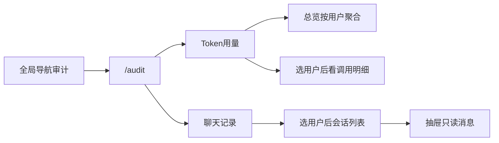

# 审计（Token 用量 / 聊天记录）

本文档说明管理员 **审计** 功能：跨用户查看及删除 Token 用量、查看及删除任意用户的聊天会话与消息。

Token **落库**机制见 [LLM 提供商配置 · Token usage 明细落库](../LLM提供商配置/README.md#14-token-usage-明细落库)；本文只覆盖 **查询与管理端 UI**。

## 1. 功能范围

- 仅 `ADMIN` 可访问首页入口、系统菜单与 `/audit` 页面。
- 页面布局与文件管理一致：顶栏 + 左侧菜单 + 内容区（`SidebarPageLayout`）。
- 左侧菜单两项：
  1. **Token用量**：默认按用户聚合总览；可选用户后看调用明细。
  2. **聊天记录**：可按用户列会话；抽屉只读查看消息，内容按聊天气泡同款 Markdown 渲染（表格、Mermaid 等）。
- 列表均支持分页（`offset`/`limit`，前端页大小 `10/20/50/100`）与字段筛选。
- **不扩大** 现有用户态 `/v1/rest/j2agent/context*`：普通用户仍只能访问自己的会话；审计读写走独立 `/audit/*` 接口。

## 2. 产品交互



### 2.1 Token 用量

| 模式 | 说明 |
|------|------|
| 总览 | 按 `user_id` 聚合：用户名、调用次数、input/output/billable 合计；顶部展示当前筛选条件下的全局合计条 |
| 明细 | 选中用户或点行「明细」后展示 `llm_usage_record` 调用行 |

筛选：

| 模式 | 筛选项 |
|------|--------|
| 总览 | 用户选择弹窗（可清空）、用户名关键字、时间范围 |
| 明细 | 用户、Agent ID、模型名（模糊）、调用类型、用量状态、时间范围 |

合计规则：总览与全局合计只统计 `usage_status = 'AVAILABLE'`；明细列表可含 `UNAVAILABLE`。

API Key 专用用户的 `app_user.id` 为 `char(32)`，历史用量行的 `user_id`（varchar）可能带尾部空格。审计查询按 `trim(user_id)` 关联用户并筛选明细，避免点开 API 用户后看不到调用行。

用户选择器按面板独立取数，避免出现筛选后无结果的用户：

- Token 用量只返回 `llm_usage_record` 中有记录的用户；
- 聊天记录只返回 `chat_context_record` 中有会话的用户；
- 若历史记录的 `user_id` 已不在 `app_user`，仍可筛选，并按当前语言显示“已删除用户 / Deleted user”。两个来源**不得取并集**。

### 2.2 聊天记录

1. 工具栏用户可选（不选则查全部）；按 `update_time` 倒序（`context_id` 编码后无法按字符串还原 UUIDv7 时间序）。
2. 会话表：标题、agentId、contextId、更新时间；筛标题关键字、agent、时间范围。
3. 「查看」打开抽屉，拉取该用户会话消息；过滤 `displayInChat === false` 的行；`renderMarkdownCached` + `renderMarkdownBlocks` 渲染正文与推理内容；不提供消息反馈。

### 2.3 删除审计数据

- Token 明细与聊天会话表均支持勾选多条后删除；跨页保留明确勾选项，筛选变化、手动刷新和删除完成后清空选择。
- Token 总览行的「删除」会删除该 `user_id` 的**全部** `llm_usage_record` 明细，不受当前时间、模型或状态筛选限制。
- 删除会话前校验整批目标；任一会话正在生成则整体拒绝，避免部分删除。删除成功后会清理消息、会话记录、会话内存和无引用附件；同一 `contextId` 仍有其他 agent 会话时保留附件。
- 所有删除均需二次确认，且仅 `ADMIN` 可调用。

## 3. REST API

OpenAPI：`j2agent/j2agent-model/src/main/resources/openapi-interface.yaml`（tag `Audit`）。  
Controller：`AuditController`，类级 `@RequiredRole(ADMIN)`。  
Service：`AuditService`。

基路径：`/v1/rest/j2agent/audit`

| 方法 | 路径 | 说明 |
|------|------|------|
| GET | `/audit/token/summary` | 按用户聚合总览 + `total` + 全局合计字段 |
| GET | `/audit/token/records` | 调用明细列表 + `total` |
| DELETE | `/audit/token/records` | 按记录 ID 批量删除 Token 明细 |
| DELETE | `/audit/token/users` | 按用户批量删除该用户全部 Token 明细 |
| GET | `/audit/contexts` | 按 `user-id`（可选）列会话 + `total` |
| DELETE | `/audit/contexts` | 按 `(contextId, agentId)` 批量删除会话 |
| GET | `/audit/context` | 按 `context-id` + `agent-id` 取消息（`AuditContextDetailDto`） |

用户筛选 API：`GET /v1/rest/j2agent/audit-users?source=token|context`。`source` 必填，决定从 Token 或会话历史中提取可筛选用户。

### 3.1 Token 总览 `GET /audit/token/summary`

Query：

| 参数 | 必填 | 说明 |
|------|------|------|
| `user-id` | 否 | 精确用户 |
| `username` | 否 | 用户名模糊（join `app_user`） |
| `from` / `to` | 否 | `create_time` 毫秒时间戳闭区间 |
| `offset` / `limit` | 否 | 默认 `0` / `20`，limit 上限 100 |

响应要点（`AuditTokenSummaryDto`）：

- `data[]`：`userId`、`username`、`callCount`、`inputTokens`、`outputTokens`、`billableTokens`
- `total`：聚合用户行数（分页）
- `globalCallCount` / `globalInputTokens` / `globalOutputTokens` / `globalBillableTokens`：与当前筛选一致的全局合计

### 3.2 Token 明细 `GET /audit/token/records`

Query：`user-id`、`agent-id`、`model-name`（模糊）、`call-kind`、`usage-status`、`from`/`to`、`offset`/`limit`。

响应：`AuditTokenRecordListDto`（`data` + `total`），行字段含 agent/model/callKind/tokens/status/`createTime` 等。

### 3.3 会话列表 `GET /audit/contexts`

| 参数 | 必填 | 说明 |
|------|------|------|
| `user-id` | 否 | 指定用户；不传则查全部 |
| `title` | 否 | 标题模糊 |
| `agent-id` | 否 | 精确 |
| `from` / `to` | 否 | `update_time` 毫秒 |
| `offset` / `limit` | 否 | 分页 |

响应：`AuditContextListDto`，`data` 项为独立 `AuditContextItemDto`（`contextId`、`agentId`、`userId`、`username`、`title`、`lastUpdateTime`），SQL 显式 `ORDER BY update_time DESC, context_id DESC, agent_id DESC`。

### 3.4 会话详情 `GET /audit/context`

| 参数 | 必填 | 说明 |
|------|------|------|
| `context-id` | 是 | 会话 ID |
| `agent-id` | 是 | 智能体 ID |

**实现要点（与用户态隔离）：**

- 仅走 `AuditService`：按主键读 `chat_context_record`，再直查 `chat_context_item`（排除 system role），经 `Translator.translateToChatMessageDto` 组装。
- **不**调用 `ChatContextService` / `ChatMemoryRepository` / 用户态 `GET /context`。
- **不**接收客户端 `user-id`（归属以库表为准，响应中带回 `userId`/`username`）。
- 响应为独立 `AuditContextDetailDto`，不是 `ChatContextDto`。
- 对象存储可用时解析附件展示 URL。
- 接口仅 ADMIN（`@RequiredRole`）。

用户态 `/v1/rest/j2agent/context*` 仍只返回当前登录用户自己的会话，审计能力不反向扩大到该路径。

### 3.5 删除接口

| 接口 | 请求体 | 行为 |
|------|--------|------|
| `DELETE /audit/token/records` | `{ "ids": ["..."] }` | 删除明确选择的 Token 明细；空、重复或不存在 ID 返回错误。 |
| `DELETE /audit/token/users` | `{ "userIds": ["..."] }` | 删除每个用户的全部 Token 明细；不应用 UI 查询条件。 |
| `DELETE /audit/contexts` | `{ "items": [{ "contextId": "...", "agentId": "..." }] }` | 删除明确选择的会话；空、重复、不存在或运行中的会话返回错误，整批不产生部分删除。 |

## 4. 数据与索引

| 表 | 用途 |
|----|------|
| `llm_usage_record` | Token 明细；总览聚合源 |
| `app_user` | join 用户名 |
| `chat_context_record` | 会话元数据 |
| `chat_context_item` | 消息正文（审计详情直读，不经 ChatMemory 栈） |

Bootstrap schema 索引：

```sql
CREATE INDEX idx_llm_usage_user_time ON llm_usage_record (user_id, create_time);
```

空库 bootstrap 已包含该索引；**已有库**需运维手工执行（本说明不涉及 Flyway 增量）。

用量与聊天消息 **无 `message_id` 关联**；按 `user_id` / `context_id` / `turn_id` 维度对照即可。

## 5. 前端

| 项 | 路径 |
|----|------|
| 路由 | `src/routes/audit.ts` → `/audit`，`requiredRole: ROLE_ADMIN` |
| 导航 | `src/pages/components/menuCard.vue`、`src/pages/HomePage.vue`（MCP 与文件管理之间） |
| 页面 | `src/pages/audit/index.vue`、`pages/TokenUsagePanel.vue`、`pages/ChatRecordPanel.vue` |
| API / 类型 | `src/api/audit.api.ts`、`src/types/audit.types.ts` |
| 用户选择 | `AuditUserPicker` 分页弹窗；调用 `getAuditUserList(source)`，按 Token / 会话面板独立获取有数据的用户，含已删除用户虚拟项 |
| 时间范围 | `GlassTimeRangePicker`（快捷预设 + 日历自定义） |
| i18n | `src/locale/lang/zh.js`、`en.js`（`audit.*`、`common.timeRange.*`） |

UI 约定对齐文件管理：`.toolbar` / `.toolbar__filters` / `.table-wrap` / `el-pagination`；筛选变更重置页码。

## 6. 源码索引

| 主题 | 路径 |
|------|------|
| OpenAPI | `j2agent/j2agent-model/.../openapi-interface.yaml`、`openapi-model.yaml` |
| Controller | `j2agent/j2agent-server/.../controller/AuditController.java` |
| Service | `j2agent/j2agent-server/.../service/audit/AuditService.java` |
| Mapper | `.../mapper/ext/LlmUsageRecordMapper.java`、`AuditChatContextExtMapper.java`（XML：`mapper/ai/ext/`） |
| Schema | `j2agent/j2agent-server/.../sql/schema/postgresql/schemas.sql` |
| 前端入口 | `src/pages/audit/` |

## 7. 不在范围内

- Token 导出、按消息 ID 关联用量、价格表核算
- 扩大用户态 `/context*` 权限
