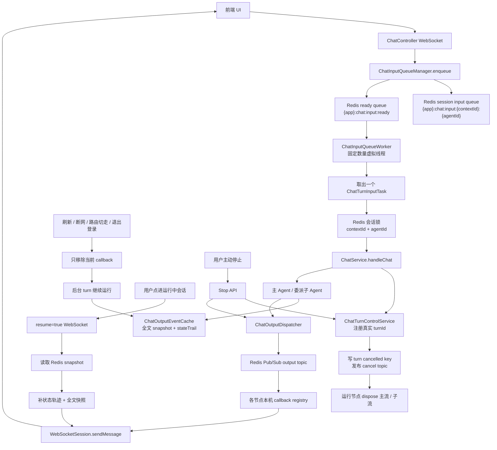
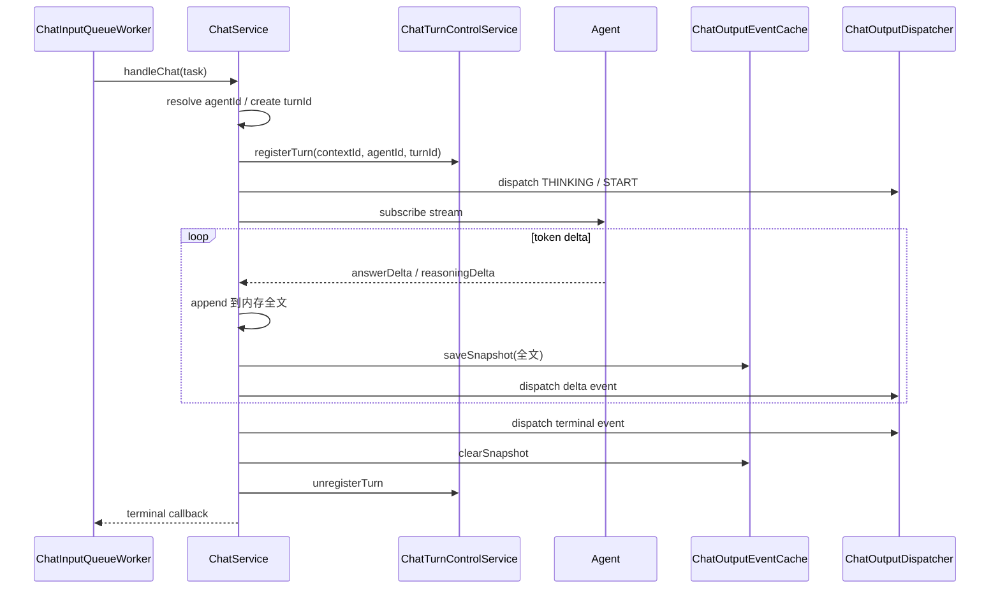
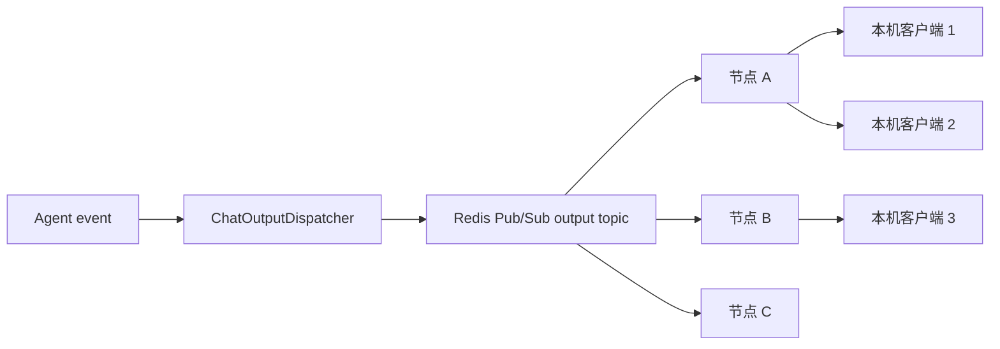
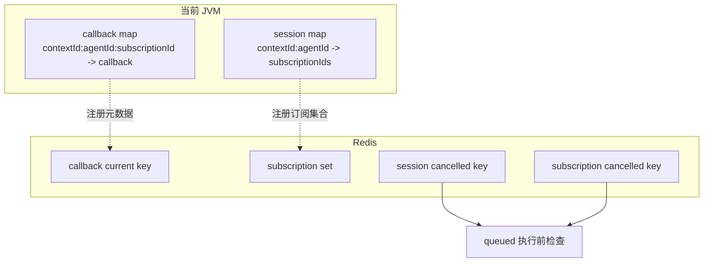
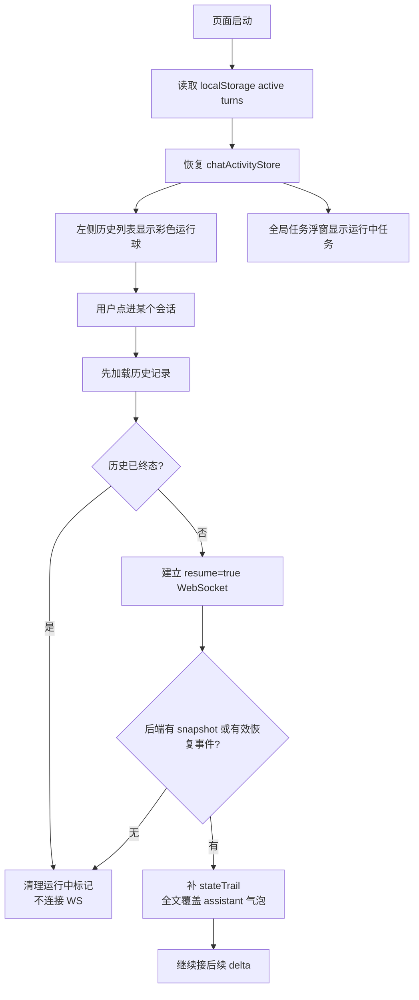
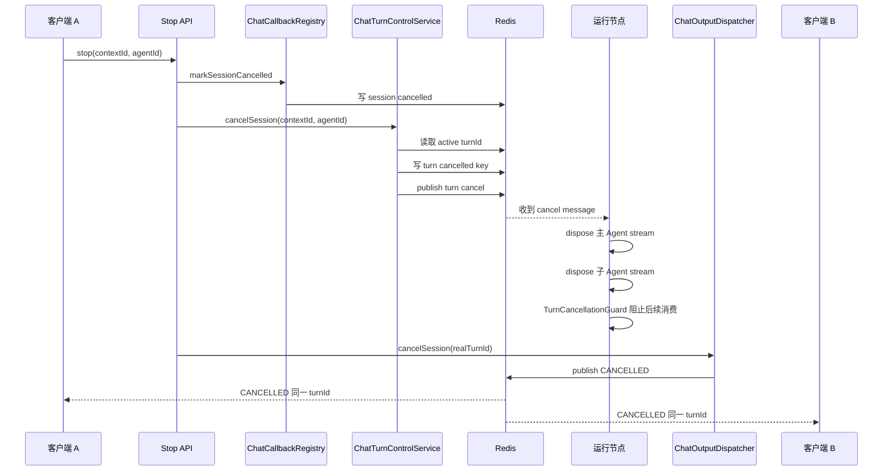
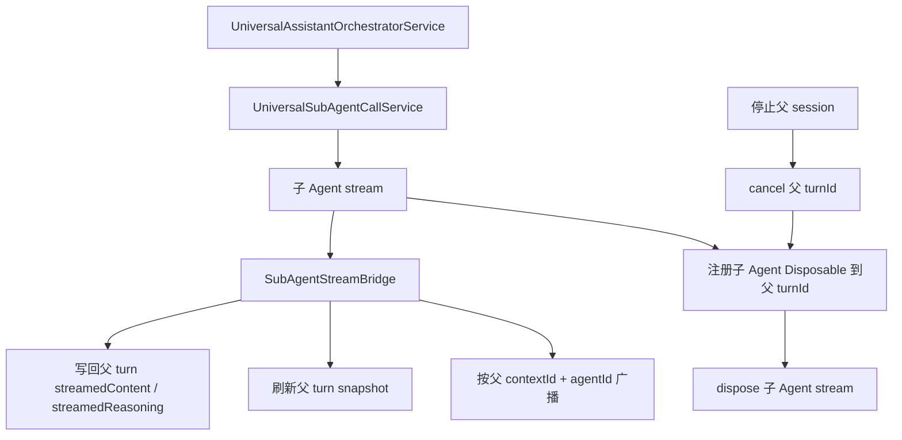
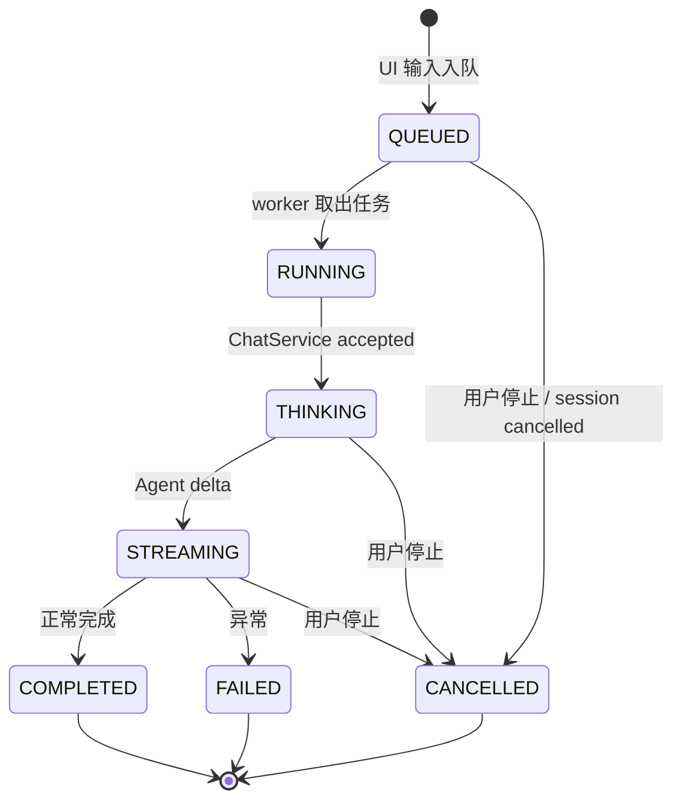

# 流式聊天后台化、队列化与 UI/LLM 解耦

## 1. 目标

聊天链路按“UI 是观察者，LLM turn 是后台任务”设计。

核心目标：

- 用户输入先进入 Redis 输入队列，由后台 worker 消费后执行 Agent。
- `worker-count` 控制当前 JVM 同时执行的完整聊天 turn 数量。
- worker 取到任务后一直等到本轮流式回答终态，才继续消费下一条任务。
- 超过 `worker-count` 的输入继续留在 Redis 队列中等待；单会话排队上限由 `max-pending-per-session` 控制（默认 3，设为 0 表示不限制）。
- 页面刷新、切换路由、退出登录、网络断开只断开 UI 连接，不中断后台 Agent 任务。
- 运行中的回答用 Redis snapshot 保存“已生成全文 + 轻量状态轨迹”，用于页面重新点进后恢复。
- 输出不使用 Redis 阻塞队列抢消费，而是 Redis Pub/Sub 广播到所有节点，再由有 WebSocket 的节点推送给本机客户端。
- 用户主动停止走独立 turn 控制面，停止 queued / running / 委派子 Agent。

设计约束：

- 不要 output 跨节点阻塞消费；输出走 Redis Pub/Sub 广播。
- worker 默认使用 JDK 虚拟线程。

当前实现仍保留 `chat-queue.enabled`、`output-cache-enabled`、`max-pending-per-session` 等配置项，生产环境建议保持默认开启。

## 2. 核心标识

| 标识 | 语义 | 用途 |
|------|------|------|
| `contextId` | 对话会话 ID | 区分历史会话 |
| `agentId` | 当前会话 Agent ID | 与 `contextId` 组成会话执行维度 |
| `subscriptionId` | WebSocket 连接 ID | 区分同一会话的不同页面、不同客户端 |
| `turnId` | 后台真实执行轮次 ID | snapshot、取消、终态合并的权威 ID |
| `contextId + agentId` | session key | 输入串行、输出广播、主动停止的维度 |

注意：

- `subscriptionId` 不是任务维度。
- 同一用户多个客户端打开同一个 `contextId + agentId` 时，是共同观察同一个后台 turn。
- 主 Agent 委派子 Agent 时，UI 仍然按父 `turnId` 展示一轮回答。

## 3. 总体流程



## 4. Input 派

Input 派处理“UI 输入进入后台执行”的链路。

| 类 | 职责 |
|----|------|
| `ChatTurnInputTask` | 一轮聊天输入任务 DTO |
| `ChatInputQueueManager` | 生成 Redis key、写入 session queue、投递 ready 标记 |
| `ChatInputQueueWorker` | 固定数量虚拟线程阻塞消费 Redis 队列，调用 `ChatService` |
| `ChatQueueProperties` | 配置 worker 数和 Redis TTL |

### 4.1 ChatTurnInputTask

任务字段固定：

```java
class ChatTurnInputTask {
    String contextId;
    String agentId;
    String subscriptionId;
    String turnId;
    ChatRequestDto request;
    UserContextBo userContext;
    long enqueueTimeMs;
}
```

### 4.2 Redis 队列

使用两级队列：

```text
{app}:chat:input:{contextId}:{agentId}
{app}:chat:input:ready
```

- session input queue 保存真实 `ChatTurnInputTask`。
- ready queue 只保存 `contextId + agentId`，用于唤醒 worker。
- worker 先从 ready queue 拿到 session key，再从对应 session input queue 取任务。
- 任务执行完成后，如果该 session input queue 还有任务，再投递一次 ready 标记。

这样可以同时满足：

- 同一 `contextId + agentId` 串行。
- 不需要 worker 扫描大量 Redis key。
- 不同 session 可以被不同 worker 并发消费。

### 4.3 worker-count 语义

`worker-count` 是当前 JVM 的完整 turn 并发上限。

```yaml
chat-queue:
  worker-count: 8
```

含义：

- 当前 JVM 启动 8 个虚拟线程 worker。
- 每个 worker 一次只处理一个 `ChatTurnInputTask`。
- worker 进入 `ChatService.handleChat` 后，要等到本轮流式回答 `COMPLETED` / `FAILED` / `CANCELLED`，才继续取下一条任务。
- 所以当前 JVM 最多同时 running 8 个完整聊天 turn。
- 第 9 个及之后的输入不会失败，继续留在 Redis 队列里排队。

`worker-count: 1` 的含义：

- 当前 JVM 只有 1 个 worker 消费 input 队列。
- 只允许 1 个完整聊天 turn 处于 running。
- 其他输入都应该停留在 Redis 队列，等待前一个 turn 结束。

多 JVM 注意：

- `worker-count` 是单 JVM 配置。
- 如果部署 3 个 JVM，且每个 JVM `worker-count: 8`，集群理论入口并发是 24。
- 如果本地调试 `worker-count: 1` 仍看到多个独立会话同时输出，优先检查是否启动了多个后端进程，或是否存在绕过队列直接调用 `ChatService` 的入口。

### 4.4 pending 语义

- pending：还留在 Redis input queue 中、尚未被 worker 取出执行的输入任务。
- running：已经被 worker 取出、进入 `ChatService.handleChat`、正在等待流式终态的后台 turn。
- pending 可以积压；单会话上限由 `max-pending-per-session` 控制（默认 3）。
- running 由 `worker-count` 控制。

## 5. ChatService 执行

`ChatService` 仍然是业务核心，不变成队列组件。

主要职责：

- 路由真实 Agent。
- 生成真实 `turnId`。
- 注册 active turn。
- 注册 turn 控制面。
- 维护 Agent 状态机。
- 处理工具调用、委派子 Agent、记忆写入。
- 累加 `answerContent` / `reasoningContent`。
- 刷新 Redis snapshot。
- 输出事件交给 `ChatOutputDispatcher`。

执行流程：



关键点：

- queued 阶段不算 running。
- 只有进入 `ChatService` 后才有真实 `turnId` 和 active turn。
- worker 必须等 terminal callback 后才能释放该 turn 的执行槽。

## 6. Output 派

Output 派处理“Agent 输出如何到达所有正在观察的 UI”。

| 类 | 职责 |
|----|------|
| `ChatCallbackRegistry` | 本机保存真实 WebSocket callback；Redis 保存 subscription 元数据和取消标记 |
| `ChatOutputDispatcher` | 发布 output 事件、广播 session 事件、串行写 WebSocket |
| `ChatOutputEventCache` | 保存运行中全文 snapshot 和轻量状态轨迹 |
| `ChatOutputSnapshot` | snapshot DTO |

### 6.1 为什么 output 不做阻塞队列

WebSocket session 只存在于当前 JVM。如果 output 做 Redis blocking queue，会出现：

- 事件可能被没有目标 WebSocket 的节点消费。
- 多客户端观察同一会话时，单消费者模型会导致其他客户端收不到。
- 取消、重连、终态合并会变复杂。
- output 顺序应该由单个 turn 内部状态机保证，不应该靠跨节点抢消费保证。

所以 output 用广播模型：



### 6.2 连接私有事件与 session 广播事件

连接私有事件：

- WebSocket connected。
- resume-empty。
- 参数错误、握手失败。

这些只发给当前 `subscriptionId`。

session 广播事件：

- Agent 状态事件。
- answer delta。
- reasoning delta。
- tool / orchestration 状态。
- COMPLETED / FAILED / CANCELLED。

这些按 `contextId + agentId` 广播给所有正在观察的客户端。

## 7. Callback Registry

`ChatCallback` 持有真实 `WebSocketSession`，不能放 Redis，也不能跨 JVM 直接调用。

因此边界是：

- 本机内存保存真实 callback。
- Redis 保存 subscription 元数据、session 订阅集合、取消标记。



参考 key：

```text
{app}:chat:callback:current:{contextId}:{agentId}
{app}:chat:callback:subscriptions:{contextId}:{agentId}
{app}:chat:callback:cancelled-session:{contextId}:{agentId}
{app}:chat:callback:cancelled:{contextId}:{agentId}:{subscriptionId}
```

## 8. Snapshot 重连恢复

Snapshot 只服务“运行中的回答恢复”，不是历史记录。

Redis key：

```text
{app}:chat:output:snapshot:{contextId}:{agentId}
```

内容：

| 字段 | 说明 |
|------|------|
| `contextId` | 会话 ID |
| `agentId` | Agent ID |
| `turnId` | 当前真实 turn |
| `answerContent` | 当前已生成回答全文 |
| `reasoningContent` | 当前已生成思考全文 |
| `state` | 当前状态 |
| `updatedAt` | 更新时间 |
| `stateTrail` | 轻量状态轨迹 |

写入规则：

- 每次主 Agent 输出 delta 后，用累计全文刷新 snapshot。
- 每次委派子 Agent 输出 delta 后，也刷新父 turn 的 snapshot。
- 状态事件写入 `stateTrail`，用于恢复编排、工具、取消等 UI 状态。
- snapshot 没有开关，默认就是后台任务恢复机制的一部分。
- TTL 只做异常兜底。

清理规则：

- turn `COMPLETED` 后清理 snapshot。
- turn `FAILED` 后清理 snapshot。
- turn `CANCELLED` 后清理 snapshot。
- 最终展示以历史记录接口为准。

## 9. 页面刷新与按需续传

前端不应该为了恢复运行中状态而自动连接所有 WebSocket。

正确模型：



纠偏规则：

- 左侧彩色球代表“本地认为可能仍在运行”，不是绝对权威。
- 用户点进会话后，先加载历史记录。
- 如果历史记录已经显示 `COMPLETED` / `FAILED` / `CANCELLED`，立即清理 running 标记。
- 如果历史没有终态，再用 `resume=true` 建立 WebSocket。
- resume 后如果没有 snapshot、没有有效状态轨迹、只有空连接，应清理 running 标记。
- 停止过早、还没有 LLM 输出、只有用户气泡的场景，也按这个规则纠偏。

## 10. UI 与 LLM 解耦

| 场景 | UI 行为 | 后端行为 |
|------|---------|----------|
| 页面刷新 | 断开当前 WebSocket，重新加载页面 | 只移除 callback，后台 turn 继续 |
| 切换路由 | 不弹“离开会中断任务”警告 | 后台 turn 继续 |
| 退出登录 | 只跳转 `/logout` | 不调用停止 |
| 网络断开 | 当前连接断开 | 后台 turn 继续 |
| 点进运行中会话 | 建立 `resume=true` 连接 | 返回 snapshot 并继续推流 |
| 用户主动停止 | 调 Stop API，本地 optimistic 收敛 | 取消 queued / running turn |

前端运行中状态来源：

- `localStorage ai.chat.activeTurns.v1`：刷新后恢复“哪些会话可能运行中”。
- `chatActivityStore`：当前页面运行中状态，驱动左侧彩色球、全局任务浮窗、输入框 busy 态。
- 历史记录和 resume 结果用于纠偏。

## 11. 主动停止控制面

停止不能依赖 WebSocket close。主动停止必须是稳定可寻址的 turn 控制面。

Stop API：

```text
POST /v1/rest/j2agent/chat/stop?context-id=...&agent-id=...
```

控制面 key：

```text
{app}:chat:turn:active:{contextId}:{agentId}
{app}:chat:turn:cancelled:{turnId}
{app}:chat:turn:cancel
```

流程：



要求：

- queued 任务：worker 执行前看到 session cancelled，直接丢弃。
- running 任务：运行节点 dispose Reactor stream。
- 主 Agent 和委派子 Agent 的 `Disposable` 都注册到同一个父 `turnId`。
- `CANCELLED` 事件必须使用真实 `turnId`，前端才能合并到当前 assistant 气泡。
- WebSocket close reason `user interrupt` 只做旧客户端兼容，不是权威停止路径。

## 12. 委派子 Agent

通用助手委派子 Agent 时，UI 仍然展示为父 turn 的一轮回答。



要求：

- 子 Agent 输出不能只从后半段开始恢复，必须写进父 snapshot 的全文。
- 子 Agent 状态必须进入父 snapshot 的 `stateTrail`。
- 子 Agent 取消检查必须走父 `turnId`。
- 父 session 停止时，子 Agent 不允许继续输出、继续落库、继续推送。

## 13. 配置

当前配置只保留必要项：

```yaml
com:
  nms:
    ai:
      chat-queue:
        enabled: true                     # 默认启用 Redis 输入队列
        worker-count: 8                   # 当前 JVM 完整聊天 turn 并发上限
        max-pending-per-session: 3        # 单会话排队上限，0 表示不限制
        take-timeout-seconds: 5           # worker 从具体会话队列等待任务的超时时间
        queued-task-ttl-seconds: 300      # 空闲输入队列 key 兜底 TTL
        output-cache-enabled: true        # 运行中 snapshot 开关
        output-cache-ttl-seconds: 300     # 运行中 snapshot 兜底 TTL
      active-chat-turn:
        heartbeat-ttl-seconds: 30
        heartbeat-touch-interval-seconds: 10
        sweeper-interval-seconds: 60
        key-fallback-ttl-hours: 24
```

配置解释：

- `worker-count`：当前 JVM 同时执行多少个完整 turn。
- `max-pending-per-session`：同一 `contextId + agentId` 在 Redis 中最多排队的输入数；超出后向前端返回队列满失败事件。
- `take-timeout-seconds`：ready 标记可能重复，worker 从 session queue 等待任务的短超时。
- `queued-task-ttl-seconds`：输入队列 key 的异常兜底过期时间。
- `output-cache-enabled` / `output-cache-ttl-seconds`：运行中 snapshot 开关与兜底 TTL；生产环境建议保持开启以支持刷新恢复。

## 14. 状态流转



前端展示：

- `QUEUED` / `RUNNING` / `THINKING` / `STREAMING`：显示运行中彩色球。
- `COMPLETED` / `FAILED` / `CANCELLED`：清理 activity 和 localStorage。
- 如果页面本地认为运行中，但历史记录或 resume 证明已经终态，立即纠偏。

## 15. 验证清单

- `worker-count: 1` 时，同一 JVM 不应同时执行两个独立聊天 turn。
- `worker-count: 8` 时，同一 JVM 最多 8 个完整 turn running，其余输入继续 pending。
- 同一 `contextId + agentId` 连续发送多条消息，应串行执行。
- 不同 `contextId + agentId` 在 worker 有空闲时可并发执行。
- 页面刷新、切换路由、退出登录不应中断后台任务。
- 左侧运行中彩色球不应自动建立所有 WebSocket。
- 用户点进运行中会话后，才建立 `resume=true` 连接。
- resume 后应先补状态轨迹，再用 snapshot 全文覆盖 assistant 气泡，后续 delta 继续 append。
- 如果点进后发现历史已终态或没有有效 snapshot，应清理运行中标记。
- 同一用户多个客户端打开同一会话，应同时收到同一份输出。
- 任意客户端主动停止后，所有客户端都收到同一真实 `turnId` 的 `CANCELLED`。
- 委派子 Agent 运行中停止时，父流和子流都应被取消。

## 16. 排查重点

如果 `worker-count: 1` 仍看到多个独立会话同时输出，按顺序排查：

- 是否有多个后端 JVM 同时连接同一个 Redis。
- 是否有旧进程未停止。
- 是否有入口绕过 `ChatInputQueueManager.enqueue` 直接调用 `ChatService.handleChat`。
- worker 是否真的等到 terminal callback 后才释放。
- 委派子 Agent 是否被误认为独立 turn，而不是父 turn 内部步骤。

如果重连后只续到后半段，按顺序排查：

- 主 Agent delta 是否每次刷新 snapshot 全文。
- 委派子 Agent delta 是否写回父 turn snapshot。
- resume 是否读取 `contextId + agentId` 对应 snapshot。
- 前端 snapshot 事件是否覆盖 assistant 气泡，而不是 append。

如果停止后 LLM 还在输出，按顺序排查：

- Stop API 是否查到真实 active `turnId`。
- turn cancelled key 是否写入 Redis。
- 运行节点是否收到 cancel topic。
- 主 Agent `Disposable` 是否注册到该 `turnId`。
- 子 Agent `Disposable` 是否注册到父 `turnId`。
- `TurnCancellationGuard` 是否覆盖主链路、工具链路、委派子链路。
