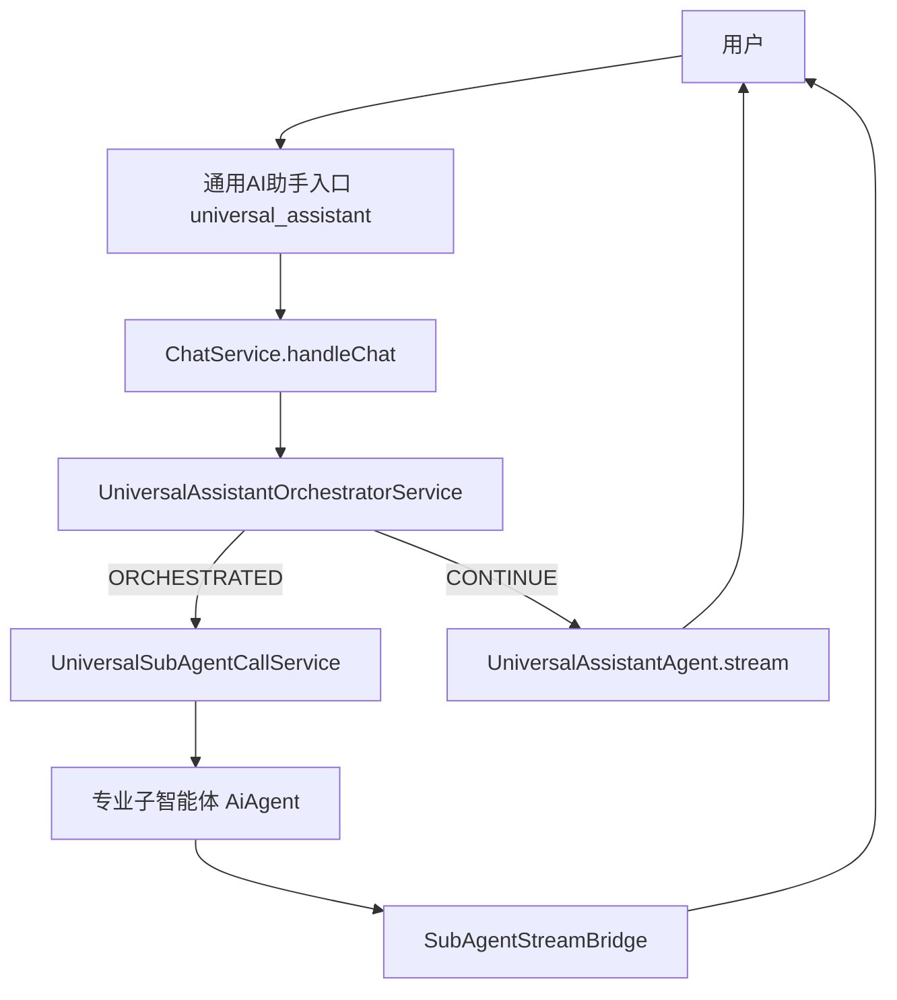
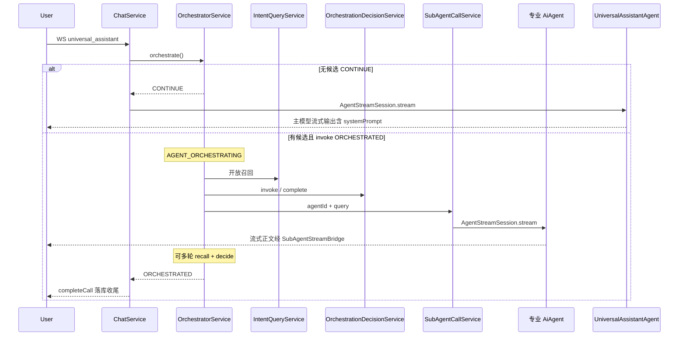
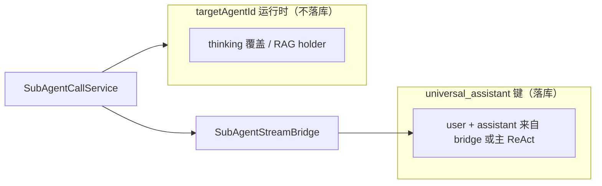

# 平台通用助手

本文说明平台内置 **`universal_assistant`（通用AI助手）** 与 **`knowledge_qa_assistant`（通用知识库问答助手）** 的架构、入口、编排服务、知识库选择与记忆隔离。内置助手与插件专业智能体一样走 **`AiAgent` + WebSocket + ChatMemory`**。

## 1. 定位

| 项 | 说明 |
|----|------|
| **agentId** | `universal_assistant`（常量见 `UniversalAssistantConstants`） |
| **展示名** | 通用AI助手 |
| **实现** | 平台内置 `UniversalAssistantAgent extends AiAgent`（`@Component`，非插件 JAR） |
| **入口** | 前端 `/chat/assistant?agent-id=universal_assistant`（汉堡菜单 / 首页「通用AI助手」） |
| **专业智能体列表** | **不出现在** `GET /agents` 卡片页；`AgentRouter.listRegisteredAgents()` 已过滤 |

用户从「通用AI助手」进入后，每回合由 **`ChatService` 前置调用 `UniversalAssistantOrchestratorService`** 完成开放召回、编排决策与子智能体调用；**无** LLM 工具。

- **需要委派**（`ORCHESTRATED`）：切子智能体上下文流式输出，**不启动**通用助手主 ReAct。
- **无需委派**（`CONTINUE`）：`UniversalAssistantAgent` 标准 ReAct + `loadSystemPrompt()` 直接回答。

## 1.1 通用知识库问答助手

| 项 | 说明 |
|----|------|
| **agentId** | `knowledge_qa_assistant`（常量见 `UniversalAssistantConstants`） |
| **展示名** | 通用知识库问答助手 |
| **实现** | 平台内置 `KnowledgeQaAssistantAgent extends AiAgent` |
| **入口** | 前端 `/chat/assistant?agent-id=knowledge_qa_assistant`（汉堡菜单 / 首页「通用知识库问答助手」） |
| **专业智能体列表** | **不出现在** `GET /agents` 卡片页；也不参与通用助手子智能体编排 |
| **RAG 来源** | 开启来源展示；命中文档继续走现有 RAG 来源发布与历史回放 |

知识库问答助手复用聊天页布局，但输入区不展示“选择智能体”，改为单个省略号下拉触发器：

- 下拉项来自 `GET /knowledge/collections`，按当前用户可读仓库过滤，以 `repositoryId` 区分仓库，支持多选；共享 collection 的仓库仍分别显示。
- 前端将最近有效选择写入当前会话 runtime，并同步到 `localStorage` key `ai-knowledge-qa-selected-collections`。
- 未选择任何 collection 时阻止发送，并提示“请至少选择一个知识库”。
- WebSocket 请求携带 `ChatRequestDto.knowledgeRepositoryIds`，内容为仓库 ID。后端校验后转换为含 repoCode 与 collection 的内部选择值；旧 `knowledgeCollections` 兼容输入也须经过可读范围校验。
- 后端在 `ChatService` 对 `knowledge_qa_assistant` 请求二次校验，空数组返回可识别错误码 `knowledgeCollectionsRequired`。
- 检索由 `DynamicKnowledgeCollectionsRetriever` 按 `AgentRunContext.knowledgeCollections` 逐个 collection 调用 `Retriever.retrieveRagChunksResult`，合并去重后返回文档。
- 展示名称取仓库配置，物理 collection 仅为存储信息；选择值使用仓库 ID，不能凭同一 collection 推定拥有其他仓库权限。省略号按钮显示当前已选数量。
- 明确选择中只要有一个无权或不存在的仓库，本轮返回 `KNOWLEDGE_ACCESS_DENIED`，不启动检索或 LLM；重建中或失败仓库返回 `KNOWLEDGE_UNAVAILABLE`。历史选择需重新鉴权。

## 2. 端到端架构

与插件 Agent 的差异：

- **同一套** `ChatService` → `AiAgent.stream` 链路（仅在 `CONTINUE` 时进入 stream）。
- 编排（召回 + 决策 + 调用）在 **`agentStreamSession.stream()` 之前**由 `UniversalAssistantOrchestratorService` 完成，**不是** ReAct Hook，**不是** `@Tool`。
- 子 Agent 使用 **无状态委派**（`subAgentCallRun=true`），聊天记录留在 universal 键；子智能体仅处理当轮提炼问题。

## 3. 单轮时序

## 4. 开放召回与决策

- **召回**（`UniversalIntentQueryService`）：宁多勿漏；完全无关时返回 `[]`，返回 `CONTINUE`。
- **决策**（`UniversalOrchestrationDecisionService`）：在候选与已执行 Trace 上输出 `invoke` 或 `complete`；同轮同一 `agentId` 不重复调用。
- **终答路径**：至少一次子调用后 → 子智能体流式输出即用户可见答复；**不**再启动通用助手主 ReAct。

## 5. 记忆与落库

- **通用助手会话键**：`userId:contextId:universal_assistant`；用户可见对话均落此键。
- **编排 Trace**：仅供给调度 LLM，**不**写入 universal ChatMemory。
- **编排委派**（`subAgentCallRun=true`）：子智能体 ReAct **不读写**专业 Agent 的 ChatMemory；流式正文经 `SubAgentStreamBridge` → `persistStreamedAssistant` 写入 universal 键。
- **直接访问专业 Agent**：另起会话键 `userId:contextId:<targetAgentId>`，走常规 Advisor 落库。
- **System Prompt**：`UniversalAssistantAgent.loadSystemPrompt()` 经 ReactAgent 注入；预落库用户消息时由 `ReactCompatibleMessageChatMemoryAdvisor` 从 `instructions` 保留 `SystemMessage`（记忆库本身不落 system）。

详见 [子智能体调用与记忆](子智能体调用与记忆.md)。

## 6. 平台能力

| 能力 | 类 | 作用 |
|------|-----|------|
| 编排服务 | `UniversalAssistantOrchestratorService` | ChatService 前置：召回、决策、子调用；返回 `CONTINUE` / `ORCHESTRATED` |
| 开放召回 | `UniversalIntentQueryService` | 结合 messages + Trace 返回候选 JSON |
| 编排决策 | `UniversalOrchestrationDecisionService` | 同步 LLM 输出 invoke / complete |
| 子智能体调用 | `UniversalSubAgentCallService` | 流式调用专业 Agent，桥接父回合 |
| 流式桥接 | `SubAgentStreamBridge` | 子 Agent 增量写入父回合 WebSocket / `streamedContent` |
| 通用助手 Agent | `UniversalAssistantAgent` | 无编排服务；`CONTINUE` 时标准 ReAct |

System Prompt 定义：`UniversalAssistantAgent#loadSystemPrompt()`（Java 内联，非外部 md 热加载）。

## 7. 与专业智能体的关系

- **可调用子智能体列表**：`AgentRouter.listCallableSubAgents()` 提供排除两个内置助手后的业务 Agent 集合，编排服务再与当前用户可使用的 Agent 求交集。原始注册表不是用户可见候选列表。公开 Agent 或有效等级 2 授权可用；管理员绕过授权过滤。
- **同一 contextId**：编排委派**不**写入 `userId:contextId:<targetAgentId>`；仅用户直接进入该专业 Agent 时才会在该键下积累历史。

## 8. 前端轨迹

- 编排阶段展示 **`AGENT_ORCHESTRATING`（智能体编排中）**（有候选且进入编排循环时）。
- 子智能体调用在轨迹中展示为 **「调用子智能体 {名称}」**（`toolName=call_sub_agent`）。
- 子 Agent 流式输出经 `SubAgentStreamBridge` 写入父回合 `streamedContent`。
- 空会话时展示 **热门问题**（`prompts/universal-assistant-qa-template.json` + `isQaTemplateEnabled()`）。

## 9. 源码索引

| 主题 | 路径 |
|------|------|
| 通用助手 Agent | `.../agent/builtin/UniversalAssistantAgent.java` |
| 编排服务 | `.../agent/builtin/UniversalAssistantOrchestratorService.java` |
| 意图召回 | `.../agent/builtin/UniversalIntentQueryService.java` |
| 编排决策 | `.../agent/builtin/UniversalOrchestrationDecisionService.java` |
| 子智能体调用 | `.../agent/builtin/UniversalSubAgentCallService.java` |
| 流式桥接 | `.../agent/builtin/SubAgentStreamBridge.java` |
| 聊天入口 | `.../service/llm/ChatService.java` |
| 记忆 Advisor | `.../advisor/ReactCompatibleMessageChatMemoryAdvisor.java` |
| 知识库问答 Agent | `.../agent/builtin/knowledgeqa/KnowledgeQaAssistantAgent.java` |
| 动态多 collection 检索 | `.../service/rag/inf/DynamicKnowledgeCollectionsRetriever.java` |
| 前端轨迹映射 | `j2agent-ui/.../stream/dispatcher.ts`、`agent-ui.ts` |

## 10. 相关文档

- [子智能体调用与记忆](子智能体调用与记忆.md)
- [Agent 记忆机制](../agent记忆机制/README.md)
- [Agent-UI 交互机制](../agent-ui交互机制/README.md)
